==== 第 1 页 ====

# Deep anomaly detection in packet payload 

Jiaxin Liu a,1 , Xucheng Song b , Yingjie Zhou a,⇑ , Xi Peng a , Yanru Zhang c , Pei Liu a,d , Dapeng Wu d , Ce Zhu b 

a College of Computer Science, Sichuan University, Chengdu 610065, China   
b School of Information and Communication Engineering, University of Electronic Science and Technology of China, Chengdu 611731, China   
c College of Computer Science and Engineering, University of Electronic Science and Technology of China, Chengdu 611731, China   
d Department of Electrical and Computer Engineering, University of Florida, Gainesville, FL 32611, USA 

# a r t i c l e i n f o 

# a b s t r a c t 

Article history:   
Received 29 September 2020   
Revised 19 December 2020   
Accepted 20 January 2021   
Available online 4 November 2021 

Keywords: Packet payload Anomaly detection Block sequence Deep learning 

With the wide deployment of edge devices, a variety of emerging applications have been deployed at the edge of network. To guarantee the safe and efficient operations of the edge applications, especially the extensive web applications, it is important and challenging to detect packet payload anomalies, which can be expressed as a number of specific strings that may cause attacks. Although some approaches have achieved remarkable progress, they are with limited applications since these approaches are dependent on in-depth expert knowledge, e.g., signatures describing anomalies or communication protocol at the application level. Moreover, they might fail to detect the payload anomalies that may have long-term dependency relationships at the edge of network. To overcome these limitations and adaptively detect anomalies from packet payloads, we propose a deep learning based framework which does not rely on any in-depth expert knowledge and is capable of detecting anomalies that have long-term dependency relationships. The proposed framework consists of two parts. First, a novel block sequence construction method is proposed to obtain a valid expression of a payload. The block sequence could encapsulate both the high-dimension information and the underlying sequential information which facilitate the anomaly detection. Secondly, we design a detection model to learn two different dependency relationships within the block sequence, which is based on Long Short-Term Memory (LSTM), Convolutional Neural Networks (CNN) and Multi-head Self Attention Mechanism. Furthermore, we cast the anomaly detection as a classification problem and employ a classifier with attention mechanism to integrate information and detect anomalies. Extensive experimental results on three public datasets indicate that our model could achieve a higher detection rate, while keeping a lower false positive rate compared with two traditional machine learning methods and three state-of-the-art methods. 

$^ { © }$ 2021 Elsevier B.V. All rights reserved. 

# 1. Introduction 

The rapid deployment of edge applications, especially the extensive web applications, brings remarkable convenience to our daily life and promotes the Internet economy. However, they are faced with abundant threats from malicious attackers. For example, Mirai was estimated to infect around 2.5 million IOT devices and cause distributed denial of service (DDoS) in the last quarter of 2016. After Mirai, Hajime and Reaper had also launched attacks against a large number of IoT devices [1]. Therefore, it is highly expected to deploy the anomaly detection system on the edge devices to monitor network traffic. 

A variety of methods have been proposed for network traffic anomaly detection, which could be classified into the following categories, namely, rule-based methods, flow-based methods, and packet-based methods. As one typical method of rule-based anomaly detection, Carmen et al. [2] applied feature selection called Generic-Feature-Selection to construct domain specific rules for Web application firewall. By adopting and integrating these technology [3,4], a number of powerful tools have been developed for constructing domain specific rules from known threats, such as Suricata [5] and Snort [6]. These tools use a highly efficient engine to discover malicious traffic by comparing the extracted signatures with the predefined rules. If malicious traffic is detected, actions can be taken to protect the cloud services. Although the rulesbased methods are effective for the known threats, they heavily depend on in-depth expert knowledge, e.g., signatures describing anomalies. 

---

==== 第 2 页 ====

Recently, some machine learning methods have been proposed to detect traffic anomaly. There are two popular directions, which use flow-based information and packet-based information to detect anomalies respectively. Flow-based anomaly detection usually analyzes the network traffic in a period of time to extract flowbased behavior features [7–9], which can be implemented in centralized cloud services to monitor massive traffic. [10] used the five-tuple to construct comprehensive behavior profiles of network traffic in terms of communication patterns of end-hosts and services. The anomalies are detected by exploring the correlation between the traffic behaviors and the corresponding characteristics. [11] presented a framework called ATLANTIC which uses similarities of flows to detect threats in traffic flows. These methods could achieve a competitive performance when the attacks related with flow-based behaviors. However, they do not perform well for some kinds of attacks, e.g., shell-code [12] and SQL injection [13], which do not express abnormal characteristics in flow-based information. 

Packet-based anomaly detection can unveil anomalies by inspecting the packet payload, which refers to the user data of network packet. The objective of packet-based anomaly detection is to discover the possible attacks that have potential abnormal characteristics in the packet payload. The anomalies might appear as a number of specific strings. For example, as one of the most common attacks, i.e., SQL injection, which injects anomalous codes, such as ‘‘ ’ or $1 = 1 \mathrm { ~ - ~ } \mathrm { \stackrel {  } { \ } { \ } } ,$ , into conditional statements of SQL queries to make them always be true. To detect this kind of anomalies from packet payload, a variety of methods have been proposed. The PAYL was proposed in [14], which used 1-gram frequency distribution of the packet payload as features to detect network anomalies. McPAD was then proposed in [12], which developed a modified feature extraction method for accurate anomaly detection. More recently, deep learning technology is explored for payload anomaly detection. Several literature [15–17] investigated by using raw measurements to detect payload anomalies. These methods use deep learning technologies to automatically extract features from packet payload. However, the performance of payload anomaly detection is still undesirable due to the incomplete representation of features. As shown in Fig. 1, there are two types of packet payload anomalies that have different distributions of anomalous bytes. Unlike the short-term packet payload anomalies whose anomalous bytes are concentrated, the anomalous bytes for longterm are scattered and their abnormal characteristics could not be addressed by existing works. The long-term packet payload anomalies are likely to occur in the emerging applications at the edge of network. Most of the existing detection methods ignore the long-term dependency relationships among the anomalous bytes. 

To tackle this, we propose a payload anomaly detection framework, which does not rely on any in-depth expert knowledge and could detect long-term packet payload anomalies. The proposed framework consists of two parts. The former part of the proposed framework is a block sequence construction method, which consists of two steps. First, it introduces a sliding block to extract items from the packet payload. Second, the low-frequency items are removed by a dictionary and the high-frequency items make up the block sequence of each payload. The constructed block sequence is a valid expression of a payload, which contain both the high-dimension information and the underlying sequential information to reveal the characteristics of payload. The latter part of the proposed framework is a detection model, which consists of a self-learning block embedding layer, a specially designed neural network and a classifier with attention mechanism. The embedding layer converts the block sequence into learnable lowdimension vectors. Then, the specially designed neural network learns the potential long-term and short-term dependency relationships among the block sequences not only in a perspective from local features to aggregative representation by using LSTM and CNN, but also in a global perspective by utilizing a multihead self attention mechanism. A classifier is stacked on the specially designed neural network, which integrates the above two kinds of information to discover potential attacks. The training process of the proposed framework is centrally executed with sufficient data collected from the actual network scenario. Then, the proposed framework could be deployed in edge devices to perform the detection process. The major contributions of this paper could be summarized as follows: 

We propose a block sequence construction method to construct a valid expression of the packet payload. The constructed block sequence contains both the high-dimension information and the underlying sequential information, which could reveal the long-term dependency relationships among the anomalous bytes in packet payload. Our block sequence construction method is not dependent on in-depth expert knowledge. To the best of our knowledge, this could be the first work that explores the long-term dependency relationships among the anomalous bytes for the payload anomaly detection. 

We design a detection model that utilizes a self-learning block embedding layer and a specially designed neural network with two branches to learn two different dependency relationships among block sequences. The first branch learns the potential long-term and short-term dependency relationships among the block sequences in a perspective from local features to aggregative representation, while the second branch based on the multi-head self attention mechanism learns the dependency relationships from a global perspective. A classifier with attention mechanism is stacked on the specially designed neural network for integrating information and discovering potential attacks in the packet payload. 

We evaluate the proposed framework that integrates the block sequence construction method and the detection model by using three public datasets. 

**Fig. 1. Two examples of the packet payload anomalies that have different distributions of anomalous bytes. For the short-term packet payload anomaly, the potential anomalous bytes are concentrated and their abnormal characteristics may be obvious, which could be detected by existing methods. In contrast, for the long-term packet payload anomaly, the potential anomalous bytes are scattered and their abnormal characteristics may not be addressed by existing works. Long-term anomalies in packet payload are more difficult to be detected than short-term ones for the existing methods. **
![Fig. 1. Two examples of the packet payload anomalies that have different distributions of anomalous bytes. For the short-term packet payload anomaly, the potential anomalous bytes are concentrated and their abnormal characteristics may be obvious, which could be detected by existing methods. In contrast, for the long-term packet payload anomaly, the potential anomalous bytes are scattered and their abnormal characteristics may not be addressed by existing works. Long-term anomalies in packet payload are more difficult to be detected than short-term ones for the existing methods. ](images/30cea2567349cd2d85e7eac37e7019e9799b347c1c99ed6f6441cc5127003a5a.jpg)

---

==== 第 3 页 ====

The rest of the paper is organized as follows. Section 2 introduces the related work, including the traditional technology and the deep learning technology for network anomaly detection. Section 3 presents the proposed framework, which integrates a block sequence construction method and a detection model. In Section 4, we evaluate the proposed framework by using three public datasets. We conclude the paper in Section 5. 

# 2. Related work 

# 2.1. Network anomaly detection 

Network anomaly detection is a fundamental task for the quality of service (QoS) of Internet. A lot of previous work focused on the anomaly detection of low-level network flows or high-level backbone networks. To detect anomalies through flow-based information, ATLANTIC [11] used deviations in the entropy of traffic flow tables to detect threats in traffic flows. In [10], K. Xu et al. detected anomalies by exploring the correlation between traffic behaviors and the corresponding characteristics in backbone networks. These methods could achieve a high detection accuracy for flow-based anomalies, but it is unlikely to detect attacks that insert anomalies in packet payloads, e.g., shell-code [12] and SQL injection [13]. Packet-based anomaly detection methods focus on inspecting the abnormal information in the packet payload. K. Wang et al. [14] proposed PAYL, which used the 1-gram frequency distribution of the payload as features to detect anomalies. R. Perdisci et al. [12] proposed McPAD to construct modified 2-gram features that contained abundant information for accurate anomaly detection. However, the accuracy of these methods heavily depends on feature construction that is complex and requires indepth expert knowledge. 

# 2.2. Deep learning methods for network anomaly detection 

Deep learning technology, which could automatically learn representation of data, was recently explored to address the limitations of the traditional machine learning methods. To detect the flow-based threats in network traffic, many studies investigated the power of deep learning for flow-based anomaly detection. Kim et al. [18] proposed C-LSTM neural network for effectively modeling the spatial and temporal information contained in raw data to detect anomalies in traffic. Tang et al. [19] proposed a flow-based Deep Neural Network (DNN) model for intrusion detection in a software defined networking environment. To detect payload-based attacks, several detection models using the raw payload data as input have been investigated in the literature. Gonzalo et al. [15] applied deep CNN and LSTM neural networks for network intrusion detection with different representations of payload data. Arne et al. [20] applied LSTM neural networks to learn latent characteristics of normal requests. H.Liu et al. [21] implemented an end-to-end deep learning detection models using raw payload data. Wei et al. [22] proposed hierarchical spatial–temporal features-based intrusion detection system, which applied deep CNN to learn the low-level spatial features of network traffic and used LSTM to learn the high-level temporal features. Sheraz N. et al. [23] developed several neural networks to build network anomaly detection models, including CNN, auto encoders and recurrent neural networks. 

# 2.3. Summary 

The most related work to our paper is [17], which proposed a RNN model with the attention mechanism called ATPAD to detect anomalies in the packet payload. The ATPAD employs the word embedding and RNN to extract features, which are used at the attention calculation stage to capture the correlation between potential byte of payload and the detection results. Different from the ATPAD model, we propose a method which utilizes the raw packet payload to construct the block sequence. The block sequence contains two different kinds of information that retains both long-term and short-term dependency relationships among the anomalous bytes in packet payload. We also design a detection model based on LSTM, CNN and multi-head self attention mechanism to capture the long-term dependency relationships among the anomalous bytes. The proposed model not only benefits from the block sequence construction method, but also takes advantage of the detection model that learns the dependency relationships in the block sequence to achieve an efficient detection performance for packet payload anomalies. To the best of our knowledge, our model achieves state-of-the-art performance on the CSIC 2010 dataset [24]. 

# 3. Proposed framework 

The proposed anomaly detection framework is shown in Fig. 2. There are four modules in this framework. The first two modules make up the former part of the proposed framework, which aims to construct a block sequence for each payload. In the first module, the payload is extracted and labeled through a preprocessing process. Then, the block sequence is constructed by a sliding block, and in order to remove information that is not important for anomaly detection, the low-frequency items of the block sequence are removed by a dictionary. The last two modules form the latter part of the proposed framework, which aims to adaptively detect anomalies for packet payload. Specifically, each item in the block sequence is converted into an embedded vector and a specially designed neural network learns two different dependency relationships in the block sequence and a classifier with attention mechanism is adopted to integrate relationships and detect anomalies in the payload. In order to better understand how the framework works, the framework is described in details in the following subsections. 

# 3.1. Packet payload preprocessing 

The objective of the packet payload preprocessing is to extract the payload from the packet and to convert the payload to a suitable form for the following modules. The payload extraction is conducted by packet parsing based on the low-level communication protocols. The following modules will try to construct efficient expression for the extracted payload. Instead of employing the encoding method, e.g., popular one-hot encoding that transforms the extracted payload into sparse embedding vectors with fixed length, we directly convert the payload of each packet into a byte stream, and each byte stream corresponds to a label. 

# 3.2. Block sequence construction 

Instead of using the byte stream of payload as features, we proposed a method to construct the block sequence that contains the high-dimension information and the underlying sequential information for anomaly detection. There are two steps in the block sequence construction process. Firstly, a block sequence is constructed for each payload by using the sliding block, which slides on byte stream to extract numerous items that could be considered as short sub-sequences. For retaining the sequential information, the items are arranged in order. Secondly, to reduce the information that is not important for anomaly detection, the lowfrequency items of each block sequence are removed by a dictionary. The dictionary records the frequency of all items in the training dataset. The whole process is described in the ‘‘Block Sequence Construction” procedure of Algorithm1. Compared with the byte stream, the block sequence condenses the complex relationships between anomalous bytes into abundant dependency relationships in the block sequence. Moreover, the block sequence removes information that is not important for anomaly detection, while the byte stream could not be simplified. 

---

==== 第 4 页 ====

**Fig. 2. Overview of the proposed framework. The proposed framework contains four modules. First, the payload is extracted and labeled through a preprocessing process. Then, the block sequence is constructed for each payload. In the last two modules, a detection model consists of an embedding layer, a specially designed neural network and a classifier, which is designed for packet payload anomaly detection. **

The process of block sequence construction is shown in Fig. 3, which corresponds to the ‘‘Extract Block Item” procedure of Algorithm1. A sliding block of specific length slides on each packet payload consecutively. When the sliding block slides to a certain position, an item would be extracted, then the sliding block would move with a fixed stride to extract items repeatedly. Finally, according to the order of the extraction process, the extracted blocks are arranged in order to construct the block sequence. 

As is mentioned above, the high-dimension information and underlying sequential information are retained in the block sequences, which are not just useful for detecting general anomalies in the payload, but also efficient for detecting anomalous bytes that have long-term dependency relationships. First of all, the high-dimension information could be considered as a kind of semantic information, which is affected by the length of sliding block. Intuitively, the longer the sliding block is, the more highdimension information the item contains. As is shown in Fig. 4(a) $\& ( \boldsymbol { \mathrm { b } } )$ , the items $k a , a e , e f , f k$ and $a b$ are extracted by the sliding block when the block length equals to 2 and the fixed stride equals to 1. These items have more information than items $k , a , e , f$ and $b$ that are extracted by the block with length equal to 1. However, when the length of the sliding block is too long, the extracted items would contain a mixture of normal information and abnormal information, which might force our detection model to be confused. Thus, a suitable length of the sliding block should be chosen. 

Moreover, as the length of sliding block increases, the block sequence could contain more abundant underlying sequential information. To be specific, under the ASCII extended 256 standard, there are $2 5 6 ^ { n }$ possible forms for an item of length $n$ , hence the sequential relationships between two items of length $n$ have at most $2 5 6 ^ { 2 n }$ possibilities. As is shown in Fig. 4(c), when the block length equals to 2, the item ka has 2 different sequential relationships, i.e., $k a { \longrightarrow } a e$ and $k a { \longrightarrow } a b$ . While the block length equals to 1, the item $k$ only contains the sequential relationship $k { \longrightarrow } a$ . Furthermore, the expressions of both the short-term and long-term dependency relationships in the block sequence are enhanced as the block length increases, which could be conducive to detect payload anomalies, especially for those that have long-term dependency relationships, such as the Union Query Attack [13]. 

Through the block sequence construction process, the longterm dependency relationships of anomalous bytes are transformed into more abundant dependency relationships between items in the block sequence. Note that, the low-frequency items in the block sequence are removed by a dictionary. On the one hand, the low-frequency items are likely to be meaningless, and they have plenty of redundant information that is not important for payload anomaly detection. On the other hand, retaining lowfrequency terms makes the block sequence too long and contain complex dependency relationships, which will not only increase the detection time, but also make the learning process be difficult. 

In the extraction process of the sliding block, a dictionary is constructed. The construction process is described in line 7 to line 12 of Algorithm1. The dictionary would record the frequency of the items that appear in the constructed block sequences of the training dataset. Then, items in the dictionary are sorted from high frequency to low frequency and the top TS high-frequency items are retained in the sorted dictionary. By using the sorted dictionary, each low-frequency item in the constructed block sequence is removed and the retained items are arranged in the original order. Finally, each payload would be reconstructed into a sequence of high-frequency items, which represent the significant information in the payload. 

**Fig. 3. An example for the process of block sequence construction. With a sliding block of length 3 and a fixed stride of length 4, the blocks extracted from a packet payload form a block sequence. **
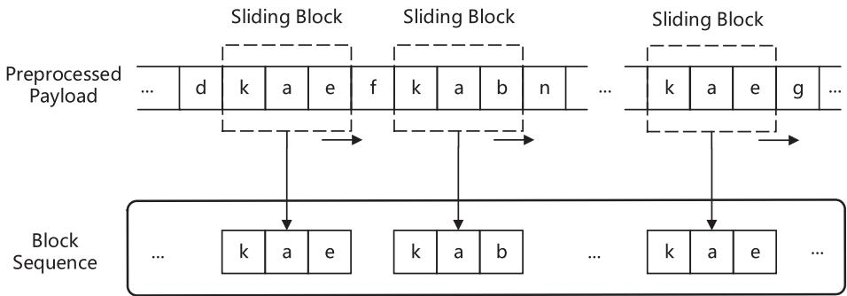

---

==== 第 5 页 ====

**Fig. 4. An example of block sequence construction process using different sliding blocks. The amount of information contained in the items extracted by different slide blocks is different. Comparing the extraction results of different sliding blocks in the same payload, the block with length 2 extracts more abundant sequential relationships than the block with length 1. **

Without rely on in-depth expert knowledge, the proposed method constructs the block sequence of each packet payload. The constructed block sequence is a valid expression of the payload, which condenses the complex relationships between anomalous bytes to reveal the long-term dependency relationships among the anomalous bytes in packet payload. 

# 3.3. Learning dependency relationships based on LSTM and CNN 

The specially designed neural network has two branches, which learn both the long-term and short-term dependency relationships in the block sequences. The first branch is a structure based on LSTM and CNN, which is presented in Fig. 5. This structure is designed to learn the potential long-term and short-term dependency relationships among the block sequences in a perspective from local features to aggregative representation. LSTM is used to learn the sequential dependency relationships among the block sequences, which are indicated in its hidden states of each time step. In order to learn both the long-term and the short-term dependency relationships in block sequences, we make use of all the LSTM hidden states in different time steps instead of only using the last hidden state that is widely adopted in classification tasks. CNN based structure is adopted to extract the local spatial information in the hidden states. 

In order to make a better expression of the high-dimension information and underlying sequential information, the highfrequency items in the block sequence are encoded by a block embedding layer. One-hot encoding does not work for this task, because it could not represent the similarity between different items and with the increase of number of items, it is faced with the curse of dimensionality. Inspired from distributed representation [25], the items in each block sequence are encoded into lowdimension embedded vectors by a self-learning block embedding layer. By concatenating all the vectors in order, a block sequence is expressed as $B L = [ e _ { 1 } ; e _ { 2 } ; \ldots ; e _ { L } ]$ , where $e _ { i } \in \mathbb { R } ^ { d }$ , and $d$ is the ¼ ½ dimensionality of the embedded vector, and $L$ 2is the length of block sequence. The embedded vectors are then used as the input of the LSTM and CNN based branch. 

In recent years, LSTM has been applied to machine translation [26], speech recognition [27], pattern prediction [28] and so on, for its capability of processing persistent information. Benefiting from its special memory cell structure and gating mechanism, it solves the exploding and vanishing gradient problems, so that it enables the efficient learning for long sequences. For example, LSTM is used for link quality prediction for smart grids [29] and a variety of LSTM based models are employed for sequence tagging in [30]. Both of them take advantage of LSTM’s powerful ability to learn sequence dependency relationships. Therefore, LSTM is adopted for purpose of learning the long-term dependency relationships in the block sequence. At each time step of LSTM, an embedded vector $e _ { t }$ is fed into the LSTM. Through inner nonlinear operations, the LSTM updates its cell state $c s _ { t }$ and outputs the current hidden state $h _ { t }$ according to the previous hidden state $h _ { t - 1 }$ and the current input $e _ { t }$ . For the output of the LSTM at each time step t, the hidden state $h _ { t }$ is calculated as follows [31]: 

Here, the $f _ { t } , i _ { t }$ and $o _ { t }$ are the forget, input and output gates, respectively. They control the process for updating the LSTM hidden state. $\sigma$ is the logistic sigmoid function [32] and the tanh is the hyperbolic tangent function [33]. W is the weight matrix and $b$ is the bias. The notations $\cdot$ and $^ *$ represent the Matmul product  and the Hadamard product [34], respectively. 

Assume that the length of block sequence is $L$ , which varies with different samples, there will be $L$ hidden states. The last hidden state of LSTM is widely adopted in classification tasks, however, it could not adequately express the long-term relationships in the block sequence. Thus, we use all the $L$ LSTM hidden states, which preserves the long-term and short-term dependency relationships in the block sequence. 

CNN is powerful for its capability to learn spatial features and reduce feature space. Benefiting from sparse connectivity, shared weights and pooling, CNN extracts the spatial correlation information via convolution without any complex processing [35]. The CNN based structure in our model is used to extract local spatial information in the LSTM hidden states. The LSTM hidden states are concatenated in order and reshaped into a two-dimensional matrix. In the convolution layer, multiple convolution filters slide over the matrix to do the convolution operations, which extract the local spatial features. The learning process for CNN based structure is progressive, where the first convolution layer extracts low-level features and the second convolution layer extracts high-level features. After each convolution layer, a max-pooling layer is adopted to obtain the largest value of a small region, which preserves the important features and enhances the generalization ability of the model. In addition, the rectified liner unit (ReLU) [36] is used as the activation function for adding nonlinear constraint. After the convolution and pooling, the spatial features of each block sequence are extracted and flattened into a vector $V _ { c n n }$ , which is an aggregative representation of the block sequence. 

---

==== 第 6 页 ====

**Fig. 5. An illustration of the structure based on LSTM and CNN. **
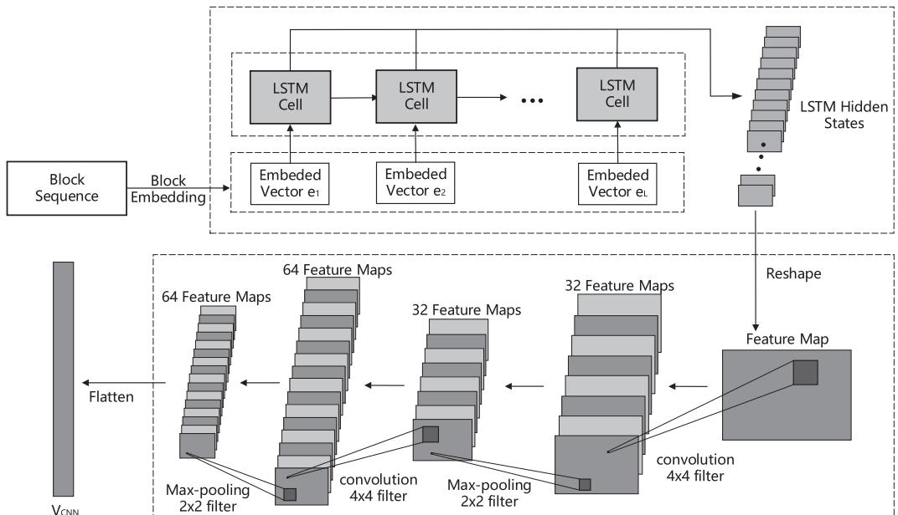

# 3.4. Learning Dependency Relationships based on Multi-head Self Attention Mechanism 

The second branch of the specially designed neural network is a structure based on multi-head self attention mechanism [37]. The purpose of this branch is to learn the potential long-term and short-term dependency relationships among the block sequences from a global perspective, which try to emphasize the most important dependency relationships between items and the block sequence directly. 

The branch based on the multi-head self attention mechanism consists of $m$ identical layers, and each layer has two sub-layers, i.e., a sub-layer with multi-head self attention mechanism and a full-connection structure with two layers. The residual connection [37] is employed to add the input of the sub-layer, i.e., the multihead self attention mechanism sub-layer or the full-connection sub-layer, to its output, and a layer normalization [38] is implemented after the residual connection process. The overall structure of one layer is shown in Fig. 6. 

In the first sub-layer, the given embedded vectors $B L = [ e _ { 1 } ; e _ { 2 } ; \ldots ; e _ { L } ]$ , where $e _ { i } \in \mathbb { R } ^ { d }$ , are transformed into three types ¼ ½ of projections, i.e., $\mathrm { Q } , \mathrm { K }$ and $\mathsf { V }$ : 

where $\{ W _ { \mathbb { Q } } , W _ { \mathrm { K } } , W _ { \mathrm { V } } \} \in \mathbb { R } ^ { d \times d }$ denote parameter matrices and $d$ f g 2equals to the dimension of the embedded vector. Then, the above three types of projections are split into $H$ different representation subspaces, e.g., $\mathsf { Q } = [ \mathsf { Q } _ { 1 } ; \mathsf { Q } _ { 2 } ; \ldots ; \mathsf { Q } _ { H } ]$ , where $\mathbb { Q } _ { i } \in \mathbb { R } ^ { L \times d _ { h e a d } }$ and $\begin{array} { r } { d _ { h e a d } = \frac { d } { H } . } \end{array}$ In each representation subspace, a scaled dot-product attention function [37], introduced in Eq. (7), is implemented independently to calculate the output of each subspace based on $\mathrm { Q } _ { i } , \mathrm { K } _ { i }$ and $\mathsf { V } _ { i }$ . The output of each subspace is first concatenated and then projected to generate the output of the first sub-layer. The above process is formulated as follows: 

MultiHea $\begin{array} { r } { { 1 } ( \mathrm { Q } , \mathrm { K } , \mathrm { V } ) = \mathsf { C o n c a t } ( h d _ { 1 } ; h d _ { 2 } ; \dots ; h d _ { H } ) W _ { 0 } , } \end{array}$ where the Concat( ) represents the operation of concatenating all heads and the parameter matrix $W _ { 0 } \in \mathbb { R } ^ { d \times d }$ . 

2The second sub-layer is a full-connection structure with two layers. The first layer is activated by ReLU [36], while the second layer has no activation function. 

Finally, the important dependency relationships of each item in the block sequence are expressed as the features $Z = [ z _ { 1 } ; z _ { 2 } ; . . . ; z _ { L } ]$ , where $z _ { i } \in \mathbb { R } ^ { d }$ , which are transmitted to the classifier for anomaly 2detection. 

# 3.5. Classifier with attention mechanism 

By casting the payload-based anomaly detection as a classification problem, a classifier is stacked on the above specially designed neural network for anomaly detection. The classifier needs to integrate two kinds of features extracted from two branches of the designed neural network. Thus, we construct a classifier with two parts, the additive attention network and an MLP (Multi Layer Perceptron), which is shown in Fig. 7. The additive attention network aims to make the classifier pay attention to the significant dependency relationships in features Z. The MLP, which is implemented by a full connection network, enables the classifier to integrate the information. In the additive attention network, the vector $c$ is derived from all the features Z. By considering the different relevance between the $V _ { c n n }$ and the features $Z$ , the vector $c$ is calculated as a weighted sum of the features $Z$ , 

---

==== 第 7 页 ====

**Fig. 6. An illustration of the neural network structure based on multi-head self attention mechanism. **
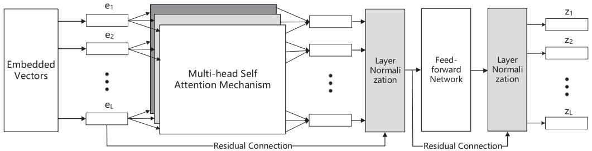

where the attention coefficient $\alpha _ { i }$ reflects the contribution of feature $z _ { i }$ in determining the representation c. Each dimension of the alignment vector $\alpha ,$ i.e., the attention coefficient $\alpha _ { i }$ , is calculated by the following softmax function [39]: 

where score $( \cdot )$ is an alignment function that measures the relevance between the $V _ { c n n }$ and the feature $z _ { i }$ . The $z _ { i }$ , which is more related to $V _ { c n n }$ , is considered to be a more significant feature for anomaly detection, so its weight $\alpha _ { i }$ will be larger. Because the $V _ { c n n }$ and $Z$ are expressions of information from different perspectives, it is inaccurate to measure the relevance by using dot or general functions [39]. We utilize an MLP to approximate the function that learns the relevance between $V _ { c n n }$ and $Z .$ , thus the score( ) is defined as follows: 

where $W _ { s }$ is the parameter matrix for the concatenation of $V _ { c n n }$ and $z _ { i } . b _ { s }$ is the bias vector and $u$ is a learnable weight vector to generate the scalar value. 

In order to integrate two kinds of information, an MLP with two layers is employed, which would convert the concatenation of $c$ and the flattened vector $V _ { c n n }$ into a two-dimension vector. The softmax function maps the two-dimension vector into a twodimension distribution $\pmb { S } = \left( S _ { 0 } , S _ { 1 } \right)$ , whose values are scaled ¼ ð Þbetween 0 and 1, and the sum of these two values is 1. The sample would be labeled by the Eq. (12). The label 0 means the classifier judges that the payload is normal, while the label 1 means the classifier judges that the payload contains anomalies. 

# 3.6. Implementation 

In the proposed framework, there are three hyper-parameters needed to be set up, which includes the length of sliding block, the stride of sliding block and the number of high-frequency items in the dictionary. In the experiments, the length of sliding block, the stride of sliding block and the number of high-frequency items in the dictionary are set up as 3, 1, and 15000, respectively. 

Regarding the parameters of the neural network we have designed, the number of hidden units of LSTM are set to 64 and the LSTM is fed with an embedded vector of 32 dimensions at each time step. Note that in the LSTM training process, some vectors filled with 0 are used as the padding for each sample to meet the input requirements of LSTM. Two convolution layers and two pooling layers are implemented in the CNN based structure. These two convolution layers have 32 and 64 filters, respectively. The size of all the filters in the convolution layers is $4 \times 4$ . Each pooling layer uses max-pooling with a $2 \times 2$  filter. The neural network based on multi-head self attention mechanism consists of 2 identical layers, and each layer has 8 heads. The feed-forward network of each layer has 128 and 32 hidden units respectively. 

The MLP of proposed classifier has 128 and 2 hidden units respectively. The dropout rate for the MLP is 0.1. During the training process, we use Adam optimizer [40] with default parameters and set the learning rate to 0.0005 for a stable training. The proposed framework is implemented by using the TensorFlow2 . All the experiments are run on a server with the NVIDIA Tesla V-100 GPU, 32 GB memory. 

# 4. Evaluation 

In this section, we conduct various experiments to evaluate the performance and effectiveness of the proposed framework for the payload anomaly detection. We first describe the datasets and metrics used for the evaluation. Then, experiments are conducted to evaluate the performance of the proposed framework on different aspects. 

# 4.1. Datasets 

We conduct experiments on three datasets to evaluate the performance of the proposed framework. These three datasets contain various types of network packet attacks. We randomly divided each dataset into three parts, the training set, the validation set and the testing set. These three sets account for $7 0 \%$ , $1 0 \%$ and $2 0 \%$ of the total data in each dataset, respectively. The overview of three datasets are shown in Table 1 and the detailed description of each dataset is introduced as follows. 

# 4.1.1. CSIC 2010 

The CSIC 2010 dataset [24] is developed at the Information Security Institute of Spanish Research National Council and contains thousands of Web requests which are generated automatically. The dataset consists of 72,000 normal requests and more than 25,000 anomalous requests, and all HTTP requests are marked as normal or abnormal. The CSIC 2010 dataset contains various types of Web attacks such as SQL injection, buffer overflow, information collection and so on. see Table 2. 

# 4.1.2. CICIDS 2017 

The CICIDS 2017 dataset [41] contains both normal traffic and up-to-date attacks which resemble the true data. The dataset is developed by the Canadian Institute for Cyber Security. Various types of attacks, include DoS, DDos, heartbleed, web attack, infiltration and botnet, are collected in this dataset. In the experiments, we only use the traffic data collected in July 6, which contains three types of Web attacks that are related with the packet payload including Brute Force, XSS and SQL injection. 

---

==== 第 8 页 ====

**Fig. 7. An illustration of the classifier with attention mechanism. The classifier integrates information from above neural networks to detect anomalies. **
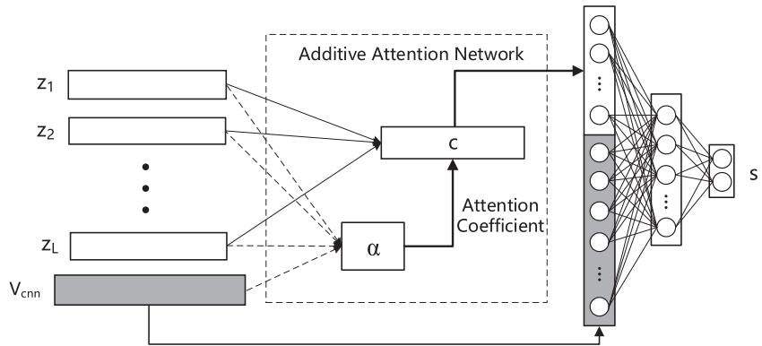

**Table 1 The detailed description of three experimental dataset. **
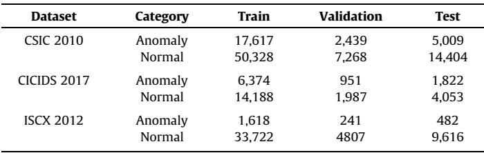
<table><tr><td>Dataset</td><td>Category</td><td>Train</td><td>Validation</td><td>Test</td></tr><tr><td>CSIC 2010</td><td>Anomaly</td><td>17,617</td><td>2,439</td><td>5,009</td></tr><tr><td></td><td>Normal</td><td>50,328</td><td>7,268</td><td>14,404</td></tr><tr><td>CICIDS 2017</td><td>Anomaly</td><td>6,374</td><td>951</td><td>1,822</td></tr><tr><td></td><td>Normal</td><td>14,188</td><td>1,987</td><td>4,053</td></tr><tr><td>ISCX 2012</td><td>Anomaly</td><td>1,618</td><td>241</td><td>482</td></tr><tr><td></td><td>Normal</td><td>33,722</td><td>4807</td><td>9,616</td></tr></table>

# 4.1.3. ISCX 2012 

ISCX 2012 dataset [42] contains network traffic which aims to describe network behaviors and intrusion patterns. This dataset contains actual traffic types such as HTTP, SMTP, SSH, IMAP, POP3, and FTP. It records packet payloads of traffic traces in the form of PCAP and the relevant profiles are publicly available for researchers. In our experiments, we use the traffic data collected in June 17th, which contains Brute Force SSH anomalies related with the packet payload. 

# 4.2. Performance metric 

In our experiments, we consider the abnormal packet payload to be a positive sample and the normal packet payload to be a negative sample. The methods performed in the experiments are evaluated on five metrics, i.e., Precision, Detection Rate (DR), False Positive Rate (FPR), Accuracy and F1-Score. These metrics are defined based on four related parameters, i.e., TP, TN, FP, FN, where TP represents the number of true positive samples, FN represents the number of false negative samples, FP represents the number of false positive samples and the TN represents the number of true negative samples. In the evaluation, the std values for performance results are calculated from ten independent experiments. 

The definitions of the five metrics are listed as follows: 

# 4.3. Results and Discussion 

In this section, we have implemented five experiments to evaluate the performance of the proposed framework in the following five aspects: 

Experiment A: How is the performance of the proposed framework compared with the traditional machine learning methods and other state-of-the-art methods?   
Experiment B: Whether the block sequence is a well expression for the packet payload? Whether each component of the detection model benefit the detection?   
Experiment C: Whether the proposed detection model can extract the long-term dependency relationships in payload anomalies?   
Experiment D: What is the influence of the hyper-parameters in the proposed framework?   
Experiment E: How does the proposed model perform on other public datasets? 

# 4.3.1. Experiment A: Performance compared with other methods 

In this experiment, we test the proposed framework on the CSIC 2010 dataset and compare the detection performance with other methods. Five compared methods are involved in this experiment. Specifically, we use two classical machine learning methods and three methods recently released as the compared methods. We use the scikit-learn library [43] to implement two traditional machine learning methods, support vector machine(SVM) [44] and random forest(RF) [45], and test them on CSIC 2010 dataset. The other three methods include a RNN and attention mechanism based method (Qin’18[17]), a CNN based method (Zhang’17[16]) and a CNN and LSTM based method (Marín’18[46]). In the experiments, we simplify the HTTP payload by ignoring the request header fields, which removes redundant information and reduces calculation complexity. The detection results of each method are listed in Table 2, respectively. 

We show the best result in each column in bold. As shown in Table 2, four deep learning based methods including the proposed one outperform the other two machine learning based methods in DR and F1-score. In all performance metrics, i.e., DR, FPR, Precision, $F _ { 1 }$ -score and accuracy, our proposed framework achieves the best results. Specifically, the DR and F1-score of the proposed method surpass those of the compared methods by at least $1 0 \%$ and $6 \%$ respectively. To the best of our knowledge, our model achieves state-of-the-art performance on the CSIC 2010 dataset. 

---

==== 第 9 页 ====

**Table 2 Comparison for the results of models introduced in Experiment A. **
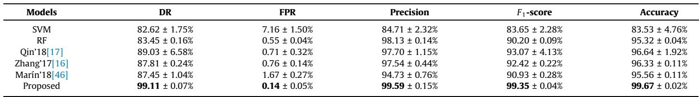
<table><tr><td>Models</td><td>DR</td><td>FPR</td><td>Precision</td><td>F1-score</td><td>Accuracy</td></tr><tr><td>SVM</td><td>82.62 ± 1.75%</td><td>7.16 ± 1.50%</td><td>84.71 ± 2.32%</td><td>83.65 ± 2.28%</td><td>83.53± 4.76%</td></tr><tr><td>RF</td><td>83.45 ± 0.16%</td><td>0.55± 0.04%</td><td>98.13 ± 0.14%</td><td>90.20 ± 0.09%</td><td>95.32 ± 0.04%</td></tr><tr><td>Qin&#x27;18[17]</td><td>89.03 ± 6.58%</td><td>0.71 ± 0.32%</td><td>97.70 ± 1.15%</td><td>93.07 ± 4.13%</td><td>96.64 ± 1.92%</td></tr><tr><td>Zhang&#x27;17[16]</td><td>87.81 ± 0.24%</td><td>0.76 ± 0.14%</td><td>97.54 ± 0.44%</td><td>92.42 ± 0.22%</td><td>96.33 ± 0.11%</td></tr><tr><td>Marin&#x27;18[46]</td><td>87.45 ± 1.04%</td><td>1.67 ± 0.27%</td><td>94.73 ± 0.76%</td><td>90.93 ± 0.28%</td><td>95.56 ± 0.11%</td></tr><tr><td>Proposed</td><td>99.11 ± 0.07%</td><td>0.14 ± 0.05%</td><td>99.59 ± 0.15%</td><td>99.35 ± 0.04%</td><td>99.67 ± 0.02%</td></tr></table>

# 4.3.2. Experiment B: Performance analysis on the block sequence construction method and each component of the proposed detection model 

We employ two parts of evaluation experiments to investigate whether the block sequence construction method can encourage promotions on detection performance and whether each part of the detection model benefit the anomaly detection. 

In the first part of the experiments, we compare the performance of our proposed detection model and other four models, with or without the adoption of the block sequence as input. The ablation experiments are conducted, which compare the proposed method with other four models consist of part(s) of components of the proposed detection model, including the LSTM component, the CNN component, the LSTM and CNN component, and the Multihead self attention component. An MLP with two layers is stacked on these models for anomaly detection. For convenience, these four models are called as the LSTM model, CNN model, LSTM-CNN model, and Multi-att model, and the ‘‘BL” prefix of a model’s name indicates the model uses the block sequence as input, otherwise the model uses the payload bytes stream. The CSIC 2010 dataset is used to test each model in this experiment. 3 

The experiment results are shown in Table 3, which demonstrate that the block sequence construction method helps all the models improve their detection performance. When the block sequence is adopted as the input of these models, the results on all the metrics are improved. Specifically, the proposed model achieve a $3 . 8 4 \%$ increase in DR and a $2 . 3 8 \%$ decrease in FPR. Also, the proposed framework with block sequence construction achieves the best results among all the five tested method in DR, FPR, $F _ { 1 }$ -score and Accuracy. Moreover, the block sequence construction method could be easily integrated with other anomaly detection methods and has the potential to improve their performance. 

Besides, in order to verify that the time consumption of the proposed framework is acceptable, we conduct additional experiments for testing the time consumption of the above models by using the CSIC 2010 dataset. The experiment results are shown in Table 4, including the average training time for one epoch, the average test time for one epoch, and the average test time for a single packet payload. see Table 4. 

As is shown in the Table 4, the centrally executed training process is time-consuming, but the test process, i.e., the detection process, only costs a few milliseconds to detect a payload. In practice, the training process for the proposed framework is centrally executed, while the detection process is directly performed at the edge of network. The average detection time of the proposed framework is $6 . 5 0 ~ \mathrm { m s }$ , which is an acceptable time consumption. 

In the second part of the experiments, we exam whether each part of the detection model benefits the anomaly detection by evaluating the detection performance of three simple classifiers, i.e., RF, SVM, and MLP, on the output features of the corresponding component. The features are extract from the trained proposed detection model, including the embedded vectors BL of the block sequence (Block Sequence), the features $Z$ of the multi-head self attention neural network(Multi-att_out), the hidden states of the LSTM (LSTM_out), the output of CNN(CNN_out), i.e., $V _ { c n n }$ , and the integrated features out of the additive attention network in the classifier(Classifier_out), respectively. The experiment results of three classifiers are shown in Fig. 8 as error bar form. The three lines in Fig. $8 ( \mathsf { a } ) \& ( \mathsf { c } )$ have an upward trend in {Block sequence, LSTM_out, CNN_out} from left to right, and they have a downward trend in Fig. 8(b), which indicate that the adoption of the LSTM component and the CNN component, benefit the final detection. The trend in Fig. 8 in {Block sequence, Multi-att_out} from left to right shows improvement on all three classifiers, which indicates the Multihead self attention component benefits the detection results. Generally, the integrated features out of the additive attention network in the classifier, which includes the features out of the LSTM and CNN component and Multi-head self attention component in the proposed model, could result in the best performance on all three classifiers. 

# 4.3.3. Experiment C: Performance analysis for the long-term dependency relationships in payload anomalies 

In this experiment, we design a more challenging anomaly detection task, compared with the basic task in Experiment B, to evaluate the proposed framework. The purpose of this task is to investigate the capability of our proposed framework on learning the long-term dependency relationships for packet payload anomalies. 

In order to conduct the above task, we use a random-insertion method to change the sequential dependency relationships of bytes in samples of the CSIC 2010 dataset. By using this method, each sample is inserted with a segment of noise, and the length of noise is $3 0 \%$ of the sample length. The position where the noise is inserted in the sample is random and the noise is all composed of character $\mathbf { \cdot _ { 0 } } \mathbf { \cdot }$ . On one hand, after the random-insertion preprocessing, the noise is added into each sample, which disrupts the original short-term dependency relationships of anomalous bytes. On the other hand, the same proportion of noise increases the similarity between each sample, which makes it more difficult to extract effective features and detect anomalies. 

Experiments are conducted on the five models that are the same as those in the first part of Experiment B. The block sequence construction method is adopted to construct the input of these five models. All the packet payloads are preprocessed by the randominsertion method introduced above. Our proposed framework gets the best performance over other models, which achieves $9 8 . 8 6 \%$ in DR, $0 . 1 6 \%$ in FPR, $9 9 . 5 2 \%$ in Precision, $9 9 . 1 9 \%$ in $F _ { 1 }$ -score, and $9 9 . 5 9 \%$ in Accuracy. As is shown in Table 5, the detection performance of the five models is declined compared with the results in Experiment B, but the proposed framework shows the best robustness to anomalies that may have long-term dependency. Typically, the DR and FPR of the proposed framework degrade by $0 . 2 5 \%$ and $0 . 0 2 \%$ , respectively, while the performance of other methods degrade by at least $0 . 5 6 \%$ and $0 . 0 3 \%$ , respectively. The results of this experiment indicate that the proposed framework has the ability to extract the long-term dependency relationships in the packet payload anomalies. 

---

==== 第 10 页 ====

**Table 3 Results of models with or without block extraction. **
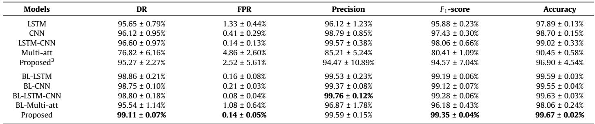
<table><tr><td>Models</td><td>DR</td><td>FPR</td><td>Precision</td><td>F1-score</td><td>Accuracy</td></tr><tr><td>LSTM</td><td>95.65 ± 0.79%</td><td>1.33 ± 0.44%</td><td>96.12 ± 1.23%</td><td>95.88 ± 0.23%</td><td>97.89 ± 0.13%</td></tr><tr><td>CNN</td><td>96.12 ± 0.95%</td><td>0.41 ± 0.29%</td><td>98.79 ± 0.85%</td><td>97.43 ± 0.30%</td><td>98.70 ± 0.15%</td></tr><tr><td>LSTM-CNN</td><td>96.60 ± 0.97%</td><td>0.14 ± 0.13%</td><td>99.57 ± 0.38%</td><td>98.06 ± 0.66%</td><td>99.02 ± 0.33%</td></tr><tr><td>Multi-att</td><td>76.82 ± 6.16%</td><td>4.86 ± 2.60%</td><td>85.21 ± 5.24%</td><td>80.41 ± 1.09%</td><td>90.45± 0.58%</td></tr><tr><td>Proposed</td><td>95.27 ± 2.27%</td><td>2.52 ± 5.61%</td><td>94.47 ± 10.89%</td><td>94.57 ± 7.04%</td><td>96.90 ± 4.54%</td></tr><tr><td>BL-LSTM</td><td>98.86 ± 0.21%</td><td>0.16 ± 0.08%</td><td>99.53 ± 0.23%</td><td>99.19 ± 0.06%</td><td>99.59 ± 0.03%</td></tr><tr><td>BL-CNN</td><td>98.75 ± 0.10%</td><td>0.21 ± 0.03%</td><td>99.37 ± 0.08%</td><td>99.12 ± 0.07%</td><td>99.55 ± 0.04%</td></tr><tr><td>BL-LSTM-CNN</td><td>98.80 ± 0.18%</td><td>0.08 ± 0.04%</td><td>99.76 ± 0.12%</td><td>99.28 ± 0.06%</td><td>99.63 ± 0.03%</td></tr><tr><td>BL-Multi-att</td><td>95.54 ± 1.14%</td><td>1.08 ± 0.64%</td><td>96.87 ± 1.78%</td><td>96.18 ± 0.43%</td><td>98.06 ± 0.24%</td></tr><tr><td>Proposed</td><td>99.11 ± 0.07%</td><td>0.14 ± 0.05%</td><td>99.59 ± 0.15%</td><td>99.35 ± 0.04%</td><td>99.67 ± 0.02%</td></tr></table>

**Table 4 The time consumption of different models on the CSIC 2010 dataset. The average training time for one epoch (Training Time), the average test time for one epoch (Test Time), and the average test time for a single packet payload (Packet Test Time) are listed. **

<table><tr><td>Models</td><td>Training Time</td><td>Test Time</td><td>Packet Test Time</td></tr><tr><td>LSTM</td><td>405.16 ± 5.47s</td><td>135.60 ± 5.96s</td><td>4.66 ± 0.20 ms</td></tr><tr><td>CNN</td><td>11.9 ± 0.11s</td><td>4.31 ± 0.09s</td><td>0.15±0.01 ms</td></tr><tr><td>LSTM-CNN</td><td>413.61 ± 6.34s</td><td>142.18 ± 4.54s</td><td>4.88 ± 0.16 ms</td></tr><tr><td>Multi-att</td><td>390.66 ± 6.72s</td><td>119.94 ± 5.92s</td><td>4.12 ± 0.20 ms</td></tr><tr><td>Proposed</td><td>423.96 ± 9.76s</td><td>145.42 ± 7.79s</td><td>4.99 ± 0.27 ms</td></tr><tr><td>BL-LSTM</td><td>650.68 ± 9.65s</td><td>182.18 ± 6.06s</td><td>6.26 ± 0.21 ms</td></tr><tr><td>BL-CNN</td><td>23.2 ± 0.15s</td><td>4.51 ± 0.14s</td><td>0.15 ± 0.01 ms</td></tr><tr><td>BL-LSTM-CNN</td><td>663.63 ± 9.77s</td><td>187.62 ± 6.50s</td><td>6.44 ± 0.22 ms</td></tr><tr><td>BL-Multi-att</td><td>653.96 ± 10.87s</td><td>135.52 ± 8.62s</td><td>4.65± 0.30 ms</td></tr><tr><td>BL-Proposed</td><td>674.52 ± 7.46s</td><td>189.15 ± 6.24s</td><td>6.50 ± 0.21 ms</td></tr></table>

# 4.3.4. Experiment D: Influence of the hyper-parameters on the proposed framework 

In this experiment, we attempt to evaluate the influence of three different hyper-parameters on the proposed framework with the CSIC 2010 dataset. We evaluate one hyper-parameter at each time while the other hyper-parameters keep the same settings as described in Experiment A. The three parameters that we evaluate include the length of sliding block, the stride of sliding block and the frequency threshold for dictionary. In experiments, the length of sliding block is set to 2, 3, 4 and 5, respectively. The block sliding length is set to 1, 2 and 3, respectively. The frequency threshold for dictionary is set to 5000, 10000, 15000 and 20000 at each time. 

The influence of the hyper-parameters on the proposed framework is shown in Fig. 9, Fig. 10 and Fig. 11. The std error bars are added on all result bars. As shown in Fig. 9(a)&(b), the proposed framework achieves the best performance, when the length of sliding block is set to 3. For different dataset, an appropriate length of sliding block should be set. This is because that when the length of sliding block is too small, the information contained in the block sequence is limited. However, if the length is too large, the normal and abnormal information might be mixed in the block sequence, resulting in a suboptimal performance. The stride of sliding block affects the amount of information extracted from the packet payload. Obviously, the Fig. $1 0 ( \mathsf { a } ) \& ( \mathsf { b } )$ demonstrates that the stride of sliding block should be set to 1. The frequency threshold for dictionary affects the amount of information retained in the block sequence. The Fig. $1 1 ( \mathsf { a } ) \& ( \mathsf { b } )$ indicates that if the threshold is to large, the dictionary may involve too much redundant information, while if the threshold is too small, the dictionary may not contain enough valuable information. 

# 4.3.5. Experiment E: Performance evaluation on other public datasets 

In this experiment, we evaluate the performance of our proposed framework and comparison methods on other two public datasets. We use the subset of the public dataset for evaluation, which contains attacks related with the packet payload. For the CICIDS 2017 dataset, we use the Web attack data includes Brute Force, XSS, SQL injection in one day’s record to make up the attack dataset, and use the normal HTTP traffic data in that day to form the normal dataset. For the ISCX 2012 dataset, we only use the Brute Force SSH attack data in one day to form the attack dataset. The normal packet payload of SSH data in that day is used to form the normal dataset. 

The detection results of our proposed framework and other five aforementioned methods on the two datasets are shown in Table 6. Note that, the CNN based method (Zhang’17[15]) is only appropriate for HTTP packets, so we only compare the performance of other five models on the ISCX 2012 dataset. Our proposed method achieves satisfactory performance on both two datasets. On the CICIDS 2017 dataset, our proposed framework achieves an average DR of $9 9 . 7 8 \%$ and an average FPR of $0 . 0 1 6 5 \%$ . On the ISCX 2012 dataset, our proposed framework achieves an average DR of $9 7 . 9 3 \%$ and an average FPR of $0 . 1 7 \%$ . 

Moreover, we have conducted more experiments on the ISCX 2012 dataset. We carried out the same experiments in Section 4.3.2 (experiment B), 4.3.3 (experiment C) and 4.3.4 (experiment D) on the ISCX 2012 dataset. Similar experimental conclusions are obtained in these experiments. 

**Fig. 8. Performance of classifiers with the features learned by each component of the trained proposed model. **
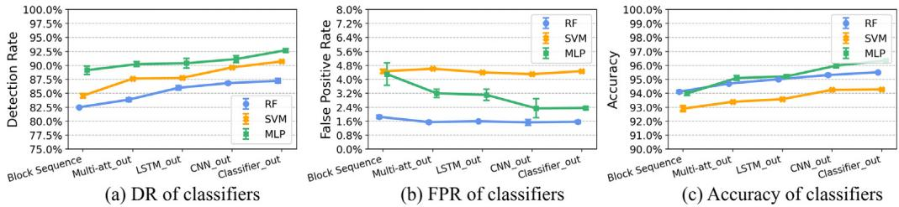

---

==== 第 11 页 ====

**Table 5 Comparison results of models in the more challenging anomaly detection task. **
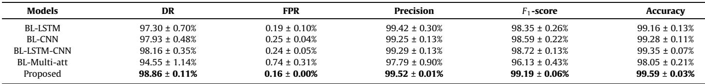
<table><tr><td>Models</td><td>DR</td><td>FPR</td><td>Precision</td><td>F1-score</td><td>Accuracy</td></tr><tr><td>BL-LSTM</td><td>97.30 ± 0.70%</td><td>0.19 ± 0.10%</td><td>99.42 ± 0.30%</td><td>98.35 ± 0.26%</td><td>99.16 ± 0.13%</td></tr><tr><td>BL-CNN</td><td>97.93 ± 0.48%</td><td>0.25 ± 0.04%</td><td>99.25± 0.13%</td><td>98.59± 0.22%</td><td>99.28 ± 0.11%</td></tr><tr><td>BL-LSTM-CNN</td><td>98.16 ± 0.35%</td><td>0.24 ± 0.05%</td><td>99.29 ± 0.13%</td><td>98.72 ± 0.13%</td><td>99.35 ± 0.07%</td></tr><tr><td>BL-Multi-att</td><td>94.55 ± 1.14%</td><td>0.74± 0.31%</td><td>97.79 ± 0.90%</td><td>96.13 ± 0.43%</td><td>98.05 ± 0.21%</td></tr><tr><td>Proposed</td><td>98.86± 0.11%</td><td>0.16 ± 0.00%</td><td>99.52 ± 0.01%</td><td>99.19 ± 0.06%</td><td>99.59 ± 0.03%</td></tr></table>

**Fig. 9. Performance on detection rate and false positive rate with different block lengths. **
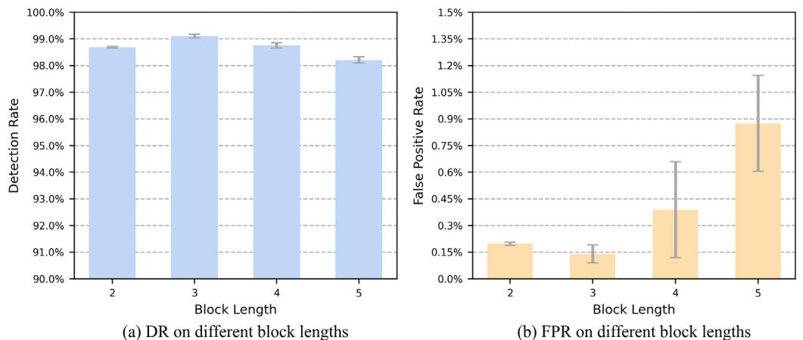

**Fig. 10. Performance on detection rate and false positive rate with different strides of sliding block. **
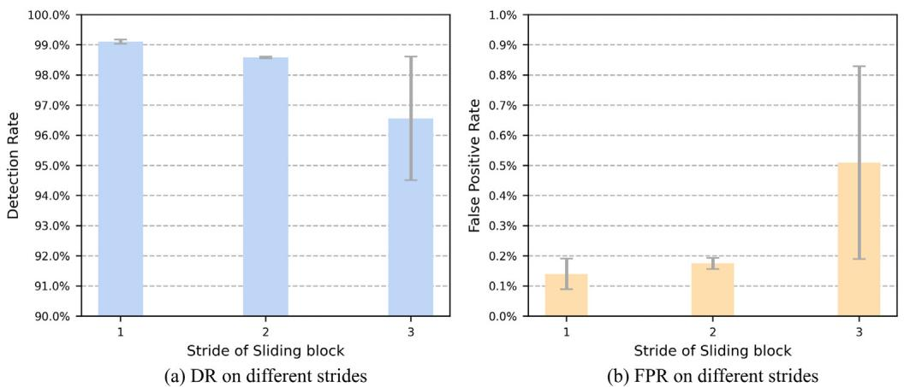

**Fig. 11. Performance on detection rate and false positive rate with different frequency thresholds for dictionary. **
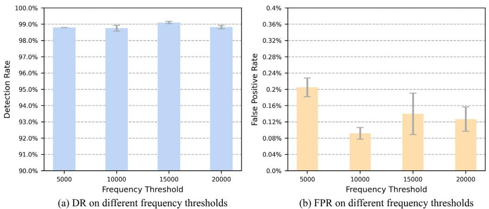

---

==== 第 12 页 ====

**Table 6 Experiment results of models on other datasets. **
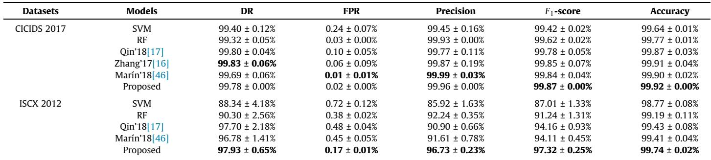
<table><tr><td>Datasets</td><td>Models</td><td>DR</td><td>FPR</td><td>Precision</td><td>F1-score</td><td>Accuracy</td></tr><tr><td>CICIDS 2017</td><td>SVM</td><td>99.40 ± 0.12%</td><td>0.24 ± 0.07%</td><td>99.45 ± 0.16%</td><td>99.42 ± 0.02%</td><td>99.64 ± 0.01%</td></tr><tr><td></td><td>RF</td><td>99.32 ± 0.05%</td><td>0.03± 0.00%</td><td>99.93 ± 0.00%</td><td>99.62 ± 0.02%</td><td>99.77 ± 0.01%</td></tr><tr><td></td><td>Qin&#x27;18[17]</td><td>99.80 ± 0.04%</td><td>0.10 ± 0.05%</td><td>99.77 ± 0.11%</td><td>99.78 ± 0.05%</td><td>99.87 ± 0.03%</td></tr><tr><td></td><td>Zhang&#x27;17[16]</td><td>99.83 ± 0.06%</td><td>0.06± 0.09%</td><td>99.87 ± 0.19%</td><td>99.85 ± 0.07%</td><td>99.91 ± 0.04%</td></tr><tr><td></td><td>Marin&#x27;18[46]</td><td>99.69 ± 0.06%</td><td>0.01 ± 0.01%</td><td>99.99 ± 0.03%</td><td>99.84 ± 0.04%</td><td>99.90 ± 0.02%</td></tr><tr><td></td><td>Proposed</td><td>99.78 ± 0.00%</td><td>0.02 ± 0.00%</td><td>99.96 ± 0.00%</td><td>99.87 ± 0.00%</td><td>99.92 ± 0.00%</td></tr><tr><td>ISCX 2012</td><td>SVM</td><td>88.34 ± 4.18%</td><td>0.72 ± 0.12%</td><td>85.92 ± 1.63%</td><td>87.01 ± 1.33%</td><td>98.77 ± 0.08%</td></tr><tr><td></td><td>RF</td><td>90.30 ± 2.56%</td><td>0.38 ± 0.02%</td><td>92.24 ± 0.35%</td><td>91.24 ± 1.31%</td><td>99.19 ± 0.11%</td></tr><tr><td></td><td>Qin&#x27;18[17]</td><td>97.70 ± 2.18%</td><td>0.48 ± 0.04%</td><td>90.90 ± 0.66%</td><td>94.16 ± 0.93%</td><td>99.43 ± 0.08%</td></tr><tr><td></td><td>Marin&#x27;18[46]</td><td>96.78 ± 1.41%</td><td>0.45± 0.05%</td><td>91.61 ± 0.78%</td><td>94.11 ± 0.45%</td><td>99.41 ± 0.04%</td></tr><tr><td></td><td>Proposed</td><td>97.93 ± 0.65%</td><td>0.17 ± 0.01%</td><td>96.73 ± 0.23%</td><td>97.32 ± 0.25%</td><td>99.74 ± 0.02%</td></tr></table>

# 5. Conclusion 

This paper proposes a payload-based anomaly detection framework, which could be deployed in a typical IoT edge device to adaptively detect packet payload anomalies. Compared with the centralized processing, our proposed framework could easily utilize the distributed computing resource at edge for network anomaly detection at the packet level. Our proposed framework consists of two parts. The first part of the framework is the block sequences construction method, which is implemented via item extraction and high-frequency item selection. The latter part of the proposed framework, i.e., the anomaly detection model, learns the potential long-term and short-term dependency relationships among the block sequences not only in a perspective from local features to aggregative representation, but also in a global perspective. Experiment results of three public datasets show that the proposed framework could achieve a high detection rate and a low false positive rate compared with existing methods in the literature. In future work, we will consider exploring a unified framework to other kinds of anomalies,e.g., anomalies in video surveillance [47], anomalies with spatio-temporaldependencies [48,49] and anomalies with limited labels [50]. 

# CRediT authorship contribution statement 

Jiaxin Liu: Investigation, Writing - original draft, Methodology, Data curation, Software, Formal analysis, Writing - review & editing. Xucheng Song: Investigation, Writing - original draft, Formal analysis, Validation, Writing - review & editing. Yingjie Zhou: Conceptualization, Methodology, Writing - review & editing, Supervision. Xi Peng: Writing - review & editing. Yanru Zhang: Writing - review & editing. Pei Liu: Writing - review & editing. Dapeng Wu: Writing - review & editing. Ce Zhu: Writing - review & editing. 

# Declaration of Competing Interest 

The authors declare that they have no known competing financial interests or personal relationships that could have appeared to influence the work reported in this paper. 

# Acknowledgment 

This work is partly supported by National Natural Science Foundation of China (NSFC) with Grant No. 61801315. 

# References 

[1] Mirai botnet linked to dyn dns ddos attacks, URL: https://www. flflashpointintel.com/blog/cybercrime/mirai-botnet-linked-dyn-dns-ddosattacks/..   
[2] C. Torrano-Gimenez, H.T. Nguyen, G. Alvarez, S. Petrovic´, K. Franke, Applying feature selection to payload-based web application firewalls, in: 2011 Third International Workshop on Security and Communication Networks (IWSCN), IEEE 2011 (2011) 75–81.   
[3] C. Torrano-Gimenez, H.T. Nguyen, G. Alvarez, K. Franke, Combining expert knowledge with automatic feature extraction for reliable web attack detection, Secur. Commun. Networks 8 (16) (2015) 2750–2767.   
[4] S.-C. Lin, S.-S. Tseng, Constructing detection knowledge for ddos intrusion tolerance, Expert Syst. Appl. 27 (3) (2004) 379–390.   
[5] Suricata, URL: https://suricata-ids.org/..   
[6] Snort, URL: https://www.snort.org/..   
[7] J.T. Zhou, H. Zhang, D. Jin, X. Peng, Dual adversarial transfer for sequence labeling, IEEE Trans. Pattern Anal. Mach. Intell. (2019) 1.   
[8] L. Zhang, J. Lin, R. Karim, Adaptive kernel density-based anomaly detection for nonlinear systems, Knowl.-Based Syst. 139 (2018) 50–63.   
[9] H. Ren, M. Liu, Z. Li, W. Pedrycz, A piecewise aggregate pattern representation approach for anomaly detection in time series, Knowl.-Based Syst. 135 (2017) 29–39.   
[10] K. Xu, Z. Zhang, S. Bhattacharyya, Profiling internet backbone traffic: behavior models and applications, in: ACM special interest group on data communication, ACM, 2005, pp. 169–180..   
[11] A.S. da Silva, J.A. Wickboldt, L.Z. Granville, A. Schaeffer-Filho, Atlantic: A framework for anomaly traffic detection, classification, and mitigation in sdn, in: NOMS 2016–2016 IEEE/IFIP Network Operations and Management Symposium IEEE, 2016, pp. 27–35.   
[12] R. Perdisci, D. Ariu, P. Fogla, G. Giacinto, W. Lee, Mcpad: a multiple classifier system for accurate payload-based anomaly detection, Comput. Netw. 53 (6) (2009) 864–881.   
[13] W.G. Halfond, J. Viegas, A. Orso, et al., A classification of sql-injection attacks and countermeasures, in: Proceedings of the IEEE International Symposium on Secure Software Engineering IEEE, 2006, pp. 13–15.   
[14] K. Wang, S.J. Stolfo, Anomalous payload-based network intrusion detection, in: International Workshop on Recent Advances in Intrusion Detection, Springer, 2004, pp. 203–222..   
[15] G. Marin, P. Casas, G. Capdehourat, Rawpower: Deep learning based anomaly detection from raw network traffic measurements, in: Proceedings of the ACM SIGCOMM 2018 Conference on Posters and Demos ACM, 2018, pp. 75–77.   
[16] M. Zhang, B. Xu, S. Bai, S. Lu, Z. Lin, A deep learning method to detect web attacks using a specially designed cnn, in: International Conference on Neural Information Processing, Springer, 2017, pp. 828–836..   
[17] Z.-Q. Qin, X.-K. Ma, Y.-J. Wang, Attentional payload anomaly detector for web applications, International Conference on Neural Information Processing, Springer (2018) 588–599.   
[18] T.-Y. Kim, S.-B. Cho, Web traffic anomaly detection using c-lstm neural networks, Expert Syst. Appl. 106 (2018) 66–76.   
[19] T.A. Tang, L. Mhamdi, D. McLernon, S.A.R. Zaidi, M. Ghogho, Deep learning approach for network intrusion detection in software defined networking, in: 2016 International Conference on Wireless Networks and Mobile Communications (WINCOM) IEEE, 2016, pp. 258–263.   
[20] A. Bochem, H. Zhang, D. Hogrefe, Streamlined anomaly detection in web requests using recurrent neural networks, in: 2017 IEEE Conference on Computer Communications Workshops (INFOCOM WKSHPS) IEEE, 2017, pp. 1016–1017.   
[21] H. Liu, B. Lang, M. Liu, H. Yan, Cnn and rnn based payload classification methods for attack detection, Knowl.-Based Syst. 163 (2019) 332–341.   
[22] W. Wang, Y. Sheng, J. Wang, X. Zeng, X. Ye, Y. Huang, M. Zhu, Hast-ids: Learning hierarchical spatial-temporal features using deep neural networks to improve intrusion detection, IEEE Access 6 (2017) 1792–1806.   
[23] S. Naseer, Y. Saleem, S. Khalid, M.K. Bashir, J. Han, M.M. Iqbal, K. Han, Enhanced network anomaly detection based on deep neural networks, IEEE Access 6 (2018) 48231–48246.   
[24] Csic 2010 http dataset, URL: https://www.isi.csic.es/dataset/.   
[25] A. Paccanaro, G.E. Hinton, Learning distributed representations of concepts using linear relational embedding, IEEE Trans. Knowl. Data Eng. 13 (2) (2001) 232–244.   
[26] D. Bahdanau, K. Cho, Y. Bengio, Neural machine translation by jointly learning to align and translate, arXiv preprint arXiv:1409.0473..   
[27] A. Graves, A.-R. Mohamed, G. Hinton, Speech recognition with deep recurrent neural networks, in: 2013 IEEE international conference on acoustics, speech and signal processing, IEEE 2013 (2013) 6645–6649.   
[28] H. Hu, Z. Liu, J. An, Mining mobile intelligence for wireless systems: a deep neural network approach, IEEE Comput. Intell. Mag. 15 (1) (2020) 24–31.   
[29] W. Sun, P. Li, Z. Liu, X. Xue, Q. Li, H. Zhang, J. Wang, Lstm based link quality confidence interval boundary prediction for wireless communication in smart grid, Computing..   
[30] Z. Huang, W. Xu, K. Yu, Bidirectional lstm-crf models for sequence tagging, arXiv preprint arXiv:1508.01991..   
[31] C. Zhou, C. Sun, Z. Liu, F.C.M. Lau, A c-lstm neural network for text classification, Comput. Sci. 1 (4) (2015) 39–44.   
[32] X. Yin, J. Goudriaan, E.A. Lantinga, J. Vos, H.J. Spiertz, A flexible sigmoid function of determinate growth, Ann. Bot. 91 (3) (2003) 361–371.   
[33] F. Xiao, Y. Honma, T. Kono, A simple algebraic interface capturing scheme using hyperbolic tangent function, Int. J. Numer. Meth. Fluids 48 (9) (2005) 1023–1040.   
[34] L.M. Manevitz, M. Yousef, Document classification on neural networks using only positive examples, in: Proceedings of the 23rd annual international ACM SIGIR conference on Research and development in information retrieval ACM, 2000, pp. 304–306.   
[35] A. Krizhevsky, I. Sutskever, G.E. Hinton, Imagenet classification with deep convolutional neural networks, in: Advances in neural information processing systems, 2012, pp. 1097–1105..   
[36] V. Nair, G.E. Hinton, Rectified linear units improve restricted boltzmann machines, in: Proceedings of the 27th international conference on machine learning, 2010, pp. 807–814.   
[37] A. Vaswani, N. Shazeer, N. Parmar, J. Uszkoreit, L. Jones, A.N. Gomez, Ł. Kaiser, I. Polosukhin, Attention is all you need, in: Advances in neural information processing systems, 2017, pp. 5998–6008..   
[38] J.L. Ba, J.R. Kiros, G.E. Hinton, Layer normalization, arXiv preprint arXiv:1607.06450..   
[39] M.-T. Luong, H. Pham, C.D. Manning, Effective approaches to attention-based neural machine translation, arXiv preprint arXiv:1508.04025..   
[40] D.P. Kingma, J. Ba, Adam: A method for stochastic optimization, arXiv preprint arXiv:1412.6980..   
[41] Cicids 2017 dataset, URL: https://www.unb.ca/cic/datasets/ids-2017.html..   
[42] Iscxids 2012 dataset, URL: https://www.unb.ca/cic/datasets/ids.html..   
[43] F. Pedregosa, G. Varoquaux, A. Gramfort, V. Michel, B. Thirion, O. Grisel, M. Blondel, P. Prettenhofer, R.J. Weiss, V. Dubourg, et al., Scikit-learn: machine learning in python, J. Mach. Learn. Res. 12 (2011) 2825–2830.   
[44] C.-C. Chang, C.-J. Lin, Libsvm: A library for support vector machines, ACM Trans. Intell. Syst. Technol. 2 (3) (2011) 27.   
[45] L. Breiman, Random forests, Mach. Learn. 45 (1) (2001) 5–32.   
[46] G. Marin, P. Casas, G. Capdehourat, Deepsec meets rawpower - deep learning for detection of network attacks using raw representations, measurement and modeling of computer systems 46 (3) (2019) 147–150.   
[47] W. Luo, W. Liu, D. Lian, J. Tang, L. Duan, X. Peng, S. Gao, Video anomaly detection with sparse coding inspired deep neural networks, IEEE Trans. Pattern Anal. Mach. Intell. (2019) 1.   
[48] C. Chen, K. Li, S. Teo, G. Chen, X. Zou, X. Yang, R. Vijay, J. Feng, Z. Zeng, Exploiting spatio-temporal correlations with multiple 3d con-volutional neural networks for citywide vehicle flow prediction, ICDM (2018) 893–898, https://doi.org/10.1109/ICDM.2018.00107.   
[49] C. Chen, K. Li, S.G. Teo, X. Zou, K. Li, Z. Zeng, Citywide trafficflow prediction based on multiple gated spatio-temporal convolutionalneural networks, ACM Transactions on Knowledge Discovery from Data (TKDD) 14 (4) (2020) 1–23, https://doi.org/10.1109/TNNLS.2021.3086137.   
[50] Y. Zhou, X. Song, Y. Zhang, F. Liu, C. Zhu, L. Liu, Feature Encoding With Autoencoders for Weakly Supervised Anomaly Detection, IEEE Transactions on Neural Networks and Learning Systems (2021) 1–12, https://doi.org/10.1109/ TNNLS.2021.3086137. 

---

==== 第 13 页 ====

Jiaxin Liu received the B.S. degree in Internet of Things Engineering from Sichuan University (SCU), China, in 2019, and now is a research assistant in the Sichuan University. He was a visiting scholar with the Department of Mechanical Engineering, McMaster University, Hamilton, Ontario, Canada. His current research interests include network traffic analysis, time series analysis and machine learning. 

Xucheng Song received the B.S. degree in the School of Information and Communication Engineering from University of Electronic Science and Technology of China(UESTC), China, in 2018, where he is currently pursuing his M.S. degree. His current research interest includes network traffic analysis, anomaly detection and machine learning. 

Yingjie Zhou (Member, IEEE) received his Ph.D. degree in the School of Communication and Information Engineering from University of Electronic Science and Technology of China (UESTC), China, in 2013. He is currently an associate professor in the College of Computer Science at Sichuan University (SCU), China. He was a visiting scholar in the Department of Electrical Engineering at Columbia University, New York. His current research interests include network management, behavioral data analysis, resource allocation and neural networks. 

Xi Peng (Member, IEEE) is currently a Full Professor with the College of Computer Science, Sichuan University. His current research interest includes machine intelligence and has authored more than 50 articles in these areas. He has served as an Associate Editor/Guest Editor for six journals, including the IEEE TRANSACTIONS ON SMC: SYSTEMS and the IEEE TRANSACTIONS ON NEURAL NETWORK AND LEARNING SYSTEMS and the Area Chair/Senior Program Committee Member for the conferences such as IJCAI, AAAI, and ICME. 

Yanru Zhang (Member, IEEE) received the B.S. degree in electronic engineering from University of Electronic Science and Technology of China (UESTC) in 2012, and the Ph.D. degree from the Department of Electrical and Computer Engineering, University of Houston (UH) in 2016. She worked as the Postdoctoral Fellow at UH and the Chinese University of Hong Kong successively. She is now a professor at the school of computer science at UESTC. Her current research involves the contract theory and matching theory in network economics, Internet and applications, wireless communications and networking. She received the best paper award at IEEE ICCC 2017 and ICCS 2016. 

Pei Liu received the M.Sc. degree in applied mathematics in 2015 from Chengdu University of Information Engineering, and now is a Ph.D. student in the Sichuan University, Chengdu, China. He was a visiting scholar with the Department of Electrical and Computer Engineering, University of Florida, Gainesville, FL, USA. His research interests include the areas of natural language processing, computer vision, machine learning. 

---

==== 第 14 页 ====

Dapeng Wu (Fellow, IEEE) received the B.E. degree in electrical engineering from the Huazhong University of Science and Technology, Wuhan, China, in 1990, the M. E. degree in electrical engineering from the Beijing University of Posts and Telecommunications, Beijing, China, in 1997, and the Ph.D. degree in electrical and computer engineering from Carnegie Mellon University, Pittsburgh, PA, USA, in 2003. He is currently a Professor with the Department of Electrical and Computer Engineering, University of Florida, Gainesville, FL, USA. His research interests are in the areas of networking, communications, signal processing, computer vision, machine learning, smart grid, and information and network security. He has served as the Technical Program Committee (TPC) Chair for the IEEE INFOCOM 2012; and the TPC Chair for the IEEE International Conference on Communications (ICC 2008), the Signal Processing for Communications Symposium, and as a member of the executive committee and/or technical program committee for over 80 conferences. He currently serves as the Editor-in-Chief for the IEEE TRANSACTIONS ON NETWORK SCIENCE AND ENGINEERING, and an Associate Editor for the IEEE TRANSACTIONS ON COMMUNICATIONS, the IEEE TRANSACTIONS ON SIGNAL AND INFORMATION PROCESSING OVER NETWORKS, and the IEEE Signal Processing Magazine. He was the founding Editor-in-Chief of the Journal of Advances in Multimedia (2006-2008), and an Associate Editor of the IEEE TRANSACTIONS ON CIRCUITS AND SYSTEMS FOR VIDEO TECHNOLOGY, the IEEE TRANSACTIONS ON WIRELESS COMMUNICATIONS, and the IEEE TRANSACTIONS ON VEHICULAR TECHNOLOGY. He is also the Guest-Editor of the IEEE JOURNAL ON SELECTED AREAS IN COMMUNICATIONS (JSAC), Special Issue on Crosslayer Optimized Wireless Multimedia Communications. He was elected as a Distinguished Lecturer by the IEEE Vehicular Technology Society in 2016. 

Ce Zhu (Fellow, IEEE) received the B.S. degree in electronic and information engineering from Sichuan University, Chengdu, China, in 1989, and the M.Eng. and Ph.D. degrees in electronic and information engineering from Southeast University, Nanjing, China, in 1992 and 1994, respectively. He held a postdoctoral research position with the Chinese University of Hong Kong in 1995, City University of Hong Kong, and the University of Melbourne, Australia, from 1996 to 1998. He was with Nanyang Technological University, Singapore, for 14 years from 1998 to 2012, where he was a Research Fellow, a Program Manager, an Assistant Professor, and then promoted to an Associate Professor in 2005. He has been with the University of Electronic Science and Technology of China, Chengdu, China, as a Professor since 2012. His research interests include video coding and communications, video analysis and processing, 3D video, and visual perception and applications. He has served on the editorial boards of a few journals, including as an Associate Editor of the IEEE TRANSACTIONS ON IMAGE PROCESSING, the IEEE TRANSACTIONS ON CIRCUITS AND SYSTEMS FOR VIDEO TECHNOLOGY, the IEEE TRANSACTIONS ON BROADCASTING, the IEEE SIGNAL PROCESSING LETTERS, an Editor of the IEEE COMMUNICATIONS SURVEYS AND TUTORIALS, and an Area Editor of SIGNAL PROCESSING: IMAGE COMMUNICATION. He has also served as a Guest Editor of a few special issues in international journals, including as a Guest Editor in the IEEE JOURNAL OF SELECTED TOPICS IN SIGNAL PROCESSING. He is an IEEE Distinguished Lecturer of Circuits and Systems Society from 2019 to 2020. 

---

