==== 第 1 页 ====

# Seamless security apprise method for improving the reliability of sustainable energy-based smart home applications 

Mohammed Saeed Alkatheiriä, Sajjad Hussain Chauhdary b,\*, Mohammed A. Alqarni( 

DepartmentofCybersecurity,CollgeofomputerciencedEngineeingUniversityofddah,Jeddah,udiabia Deparmentfel DepartmentfftaregneringolleofomuteriencedgiringUversityfdeh 

# ARTICLEINFO 

# ABSTRACT 

Keywords:   
Cyber security   
Q-Learning   
Security Lifetime   
Sustainable Energy   
Smart Home 

Smart homes rely on sustainable energy sources and information technologies for providing ambient assisted living (AAL） support for humans.The significance of automation and energy optimization is prominent in providing secureand reliable control over in-home applications.Security is one of the drawbacks in smart home scenarios where the connected network of applications and sustainable energy sources are exposed to risk.This article introduces the seamless security apprises method (SSAM) to monitor the connected network's administered security measure.The proposed method monitors the lifetime of the administered security measures by verifying its exploitationand vulnerable levels inaperiodic manner.Inthis verification process,thedistributed security is clasified for different operating and communicating states of the connected applications.For this state-based analysis,Q-learming isadapted to identify and update the stateand its associated security measure.It reduces the early termination ofthe security measure due to identity thefts and provides continuous support for the operating applications.Therefore,sustainable energy resources are eficiently exploited without facing convergence in application functions.The cyber security features of the connected network are exploited in administering the security fromacentralized platform.The proposed method's performance is verified using the verification time,security level,energy efficiency,and security loss. 

# Introduction 

A smart home is an interconnection of appliances that monitor smart meters’energy capacity and consume energy. Smart home in sustainability evaluates low-impact and improves the performance of the system [1].Information and communication technology (ICT) is derived for this processing,which is a communication medium between two applications [2].The smart home is connected with a device that forwards the energy to the smart meter.From the smart meter,the energy is interlinked with the home network.In turn, the home network acts as the storage medium to acquire the energy from the smart meter and manage the energy[3].Sustainability is reached by making efficient energy allocation without compromising future needs.It is processed by developing a smart meter that acquires the energy for every particular time.Here the acquired energy is stored,and in the current situation, more energy is necessary means the energy is allocated to the devices.In this manner,the necessary energy is provided to ensure energy consumption in smart meters.The tracking of energy is determined to decreases the power of the appliances in a smart home.To achieve better sustainability,it must satisfy the three cases:economy,society,and the environment [4,5]. 

In smart homes,cyber security is necessary to protect the energy fromvulnerability threats that access the home network and modifies the energy rate. Cyber security is known as information technology security,which secures the network from attackers [6].It consists of a multi-layer that provides secure energy acquiring between the smart meter and home network.If the attacker hacks the home network,the smart home's energy is modified [7].In this case,continuous energy monitoring is necessary.This periodic monitoring detects the vulnerability in the network and secures the home network from hacking [8]. Here the prediction is derived to find the attackers and resolves the issue from hacking.By processing this prediction method, the security loss is reduced,whereas it improves the system's performance [9]. They are many approaches used to detect the attack in the network and protect the system.Cyber security is based on an authentication process in which the legitimate user accesses the smart meter; thus,the security of the smart home is maintained [1O]. It makes sense to provide security features by advancing intelligent technology.The user may monitor the alarm arming and disarming and edit certain alarm settings,such as the key code.Here the user may configure remote monitoring settings.It would operate first by detecting movement in outside lights.Using electronic sensors connected to the device,the security staff or homeowner would be forced to open any window or door.In fires,break-ins, orany other disasters,conventional home security systems warn authorities that automated housing is more secure.Many smart home monitoring systems will submit intelligent notices that separate welcome guests from foreign guests.The best thing is an integrated home safety system,which is entirely adjustable to your unique security specifications as part of your home automation installation. 

---

==== 第 2 页 ====

Smart house technology helps consumers,via smart home apps, smartphones,or other networked devices,to access and control their connected devices.Regardless of whether they are home or away,users can monitor remotely related home systems. Smart devices are all pretty fresh themselves.However,it would help if you took care to ensure that the devices and networks are as secure as possible.Cleaning your device's boring security aspects improves the chances of a secure and intelligent home. 

Security in a smart home is proposed by introducing a smart meter that tracks the energy and maintains the security.In this aspect, the energy efficiency in a smart home is achieved by monitoring the energy usage every particular time [11].A smart home app is an application used to remotely control and manage connected non-computing devices in the home,generally from a smartphone or tablet,and sometimes called a home automation app or a smart home automation app. Smart home apps can be single-use applications such as controlling intelligent light bulbs to automate and manage your home's lighting system. Besides lighting, home components that can automate and monitor smart home apps include heating and air conditioning, entertainment systems, doors or windows,windows,protection systems,water sprinkling,and appliances.However,smart home applications can track devices and environments with the necessary sensors and give a warning when a problem occurs.The energy efficiency is resolved by improving the security level in-home network in which the necessary energy is provided to the devices [12].In this manner,the photovoltaic (PV) device offers more energy efficiency in smart home based on solar energy [13]. The energy consumption increases the lifetime of the appliances processed based on the cyber security method [14]. Smart homes use devices that can attach to the internet and contain small computers that allow them to be operated remotely. Second, it can't be safe for individual devices. Some home IoT devices are swiftly placed on the market and may not have addressed their protection adequately.In certain situations,user manuals don't discuss privacy issues or include adequate details to ensure that the system is secure.For example,baby screens and safety cameras have been hacked,allowing offenders to see inside a home. Even if the intelligent home has some security issues,it can build opportunities for a safer home.While most devices aim to simplify your life, some may provide smart home safety and security. 

In this case,cyber security is initiated to evaluate better energy efficiency in the smart home.Both security and energy efficiency are used to derive the optimal smart home [15].The presented work addresses the exploitation of vulnerability based on cyber security.It improves the security level and energy efficiency,whereas;it decreases the verification time and security los.It is evaluated by introducing SSAM in this Qlearning based update is processed to improve the security level. 

# Related works 

Zungeru et al.[16] presented a secure smart home to address selfenergy harvesting;two evaluation types are determined.Safe access control is modeled for authorization; a second active electronic device is used for wireless communication.The access is provided to the control unit, comparator unit, memory unit,and switching unit. 

Shuai et al. [17] proposed an efficient and anonymous authentication to provide security in smart homes.The security is based on introducing an Elliptic Curve Cryptography (ECC),which resolves the clock synchronization problems.Based on this,many security features are used in this smart environment to manage security. 

Actual Proof of Work (PoW) is developed to address the status, event, and usage of data in the IoT platform.In[18],a Blockchain is introduced in fog-to-core gateway points to decrease the in-home gateway's computation power.For achieving a better gateway function,private local Blockchain is deployed. 

Blockchain-based smart home gateway network is developed by Lee et al.[19],which is performed in three-layer networks such as device, gateway,and cloud layers. This paper aims to improve accuracy and decrease response time by utilizing Ethereum blockchain technology. Here the authentication and communication are performed between the networks. 

Intrusion Detection System (IDS) is developed in [2O] to detect the network's distributed attackers to provide a secure smart home ecosystem.In this work,an Internet Service Provider (ISP)is proposed based on Home Gateway (HG) used to control and manage the home entities.The management of energy in a smart home is determined using the command and control center. 

In [21],LoRaWAN is developed to improve the performance and efficiency of communication.This paper aims to design a secure smart home that is deployed by making a remote control.Here informal security analysis is used to derive long-range and secure communication. 

Naoui et al.[22] introduced an Elliptic Curve Cryptography by the Scyther tool.Here it addresses the issues in secure and lightweight remote user authentication.In this,the attackers are monitored for every instance of time.Thus, the session key is provided to derive formal security,which improves the device's effectiveness. 

Heating,Ventilation,and Air Conditioning (HVAC) load are designed by Yu et al.[23] to resolve the energy cost and discomfort.For this,an energy management based Lyapunov optimization technique is developed for reliable feasibility and performance.The analysis time is decreased by deploying an online energy management algorithm. 

An autonomous residential home is developed in [24],which addresses energy consumption costs and decreases by improving the energy flow. This work Energy Storage System (ESS) is developed by integrating renewable energy resources，photovoltaic (PV).Energy consumption is resolved by introducing a Dynamic distributed energy storage strategy (DDESS). 

In [25] Electronic Device Sleep Scheduling Algorithm (EDSA） is proposed to reduce the time and improves efficiency.In this work, four types of processing are deployed,such as identifying the appliances, monitoring the sensor,load balancing is performed,and reliable data is achieved in a heterogeneous environment using Hadoop Ecosystem. 

Dibavar et al.[26] presented a hybrid robust-stochastic optimization approach to evaluate energy management's profitability.A robust optimization approach (ROA) is used to detect the PV generation and energy cost. It is evaluated by introducing stochastic programming (SP) to make better decisions in the energy market. 

A modular platform is designed by Popa etal.[27] for smart homes to detect energy usage and consumption.The author introduced an energy-aware method in a smart environment and monitored the energy on time.Using the modular platform collects the energy and store in a smart environment,and it uses it if there is a necessity. 

Albuquerque et al. [28] introduced an integer linear programming issue in a smart home associated with local off-grid micro-generation. A weighted aggregation function is used for energy consumption in a smart home.In this work,the objective is to improve comfort and reduce energy costs. 

# Proposed method 

Smart home energy sustainability provides AAL and secure control in-home applications that include renewable energy.Energy sustainability is provided by tracking the energy usage for every allocated time; processing this manages energy consumption.Smart household technology will make your home feel magic.Automating lighting,music, and even your blinds will add a sleek, futuristic feel to your home and save you time.However,saving energy is a huge advantage of smart home technology. From tracking your energy usage to automation, some systems will help you minimize the amount of water and energy you use, thereby reducing your house's environmental impact. 

---

==== 第 3 页 ====

**Fig.1.Smart Home Infrastructure. **
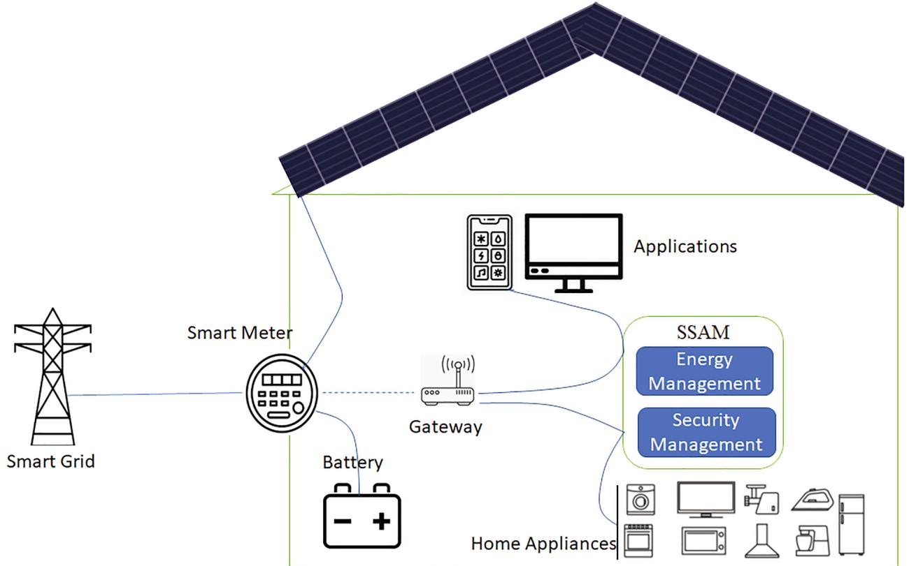

In Fig.1,a smart home infrastructure with energy and security management is illustrated. 

The presented work focuses on improving the security level and energy eficiency,whereas; it decreases security loss and verification time.This seamless security appraises method (SSAM) is introduced to maintain security in a connected network.A smart household device should be authenticated before receive or transmitting data each time it connects to the network.Itmeans the data comes from a legal device and not from a fake source.For two-way authentication,it can be used cryptography algorithms with symmetrical keys or asymmetric keys. The latter means the data comes from a legal device and not from a fake source.For two-way authentication, cryptographic algorithms that use symmetric keys or asymmetric keys may be used. 

The objective of the proposed work is derived in the following equation (1). 

In the above equation,the proposed work's objective is evaluated in which it addresses four-level to improve the performance and sustainability of the energy in the smart home.Here the energy is represented as $\delta ^ { \ast }$ which is acquired from the appliances and forwards to the smart meter, which is denoted asfoandy. By computing $\mathbb { S } ^ { ' } \in \left( \frac { \varpi } { \delta } { - } \eta ^ { ' } \right)$ the sustainability of energy are addressed,and it is termed as $\mathbb { S } '$ where the analysis is denoted $\operatorname { a s } \varpi$ ,the sustainability ina smart home is termed as $\eta ^ { ' }$ .Most app-based smart devices operate over Wi-Fi connections to your home network.These devices attach to a severe system somewhere which you access on your smart device through applications. Some home automation app technology connects directly via Bluetooth to your smart device.Its data is then analyzed to identify possible security breaches or system risks.A wide range of practices,such as quarantining equipment based on anomalous actions established under the overall device protection strategy,should be taken when found.The monitor analysis cycle can be run in real-time or later to detect possible attack scenarios and recognize use trends.It is necessary to ensure that endpoint devices are protected against potential manipulation and data handling,resulting in inaccurate event reporting. 

---

==== 第 4 页 ====

**Fig.2.Energy and Security Management. **
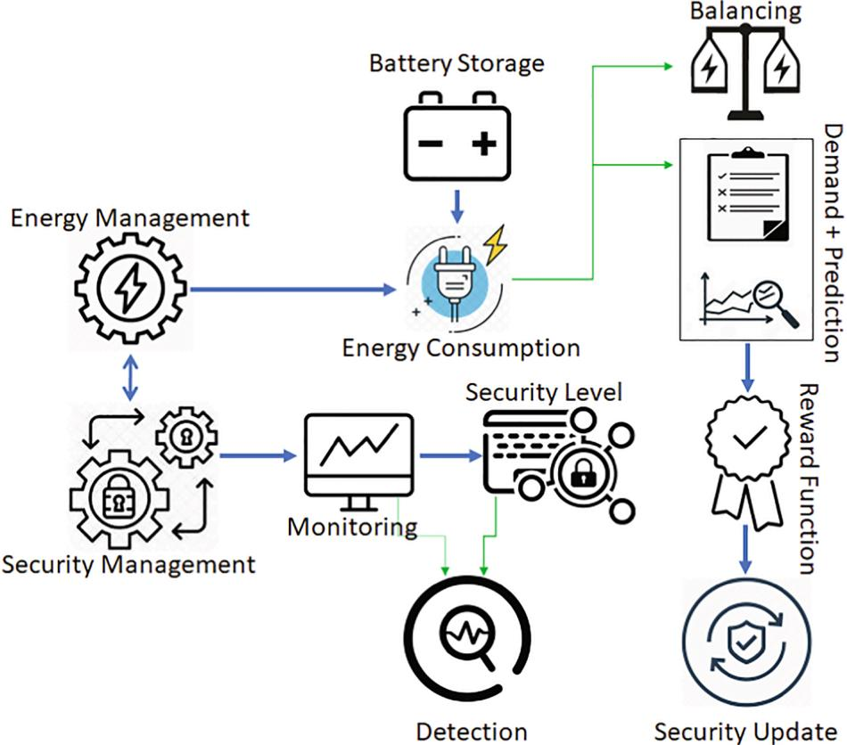

Thus the verification time must be lesser,which is denoted as $\vartheta ^ { ' }$ to derive the reliable security that is represented as $\mu _ { 0 }$ it is evaluated by tracking the energy for every instance that is termed asx'.By formulating this,security loss and energy loss are decreased,which is represented aso'anda'.Thus,secure energy $\phi _ { 0 }$ based processing is monitored in a smart home by maintaining the sustainability level,which is processed byupdating the security level,which is represented $\scriptstyle { \mathrm { a s u l } } _ { 0 }$ .Post to this processing,the following equation is used to track the smart meter's energy,whether the acquired energy is higher or lower.Based on this,it forwards to the end-application and detects energy usage. 

The tracking of energy in the smart meter is computed in the above equation (2) in this energy acquiring from the appliances is represented asq'.In this tracking of energy in the smart meter is evaluated based on prediction. Thus,from the smart meter,the energy is modified either by vulnerability or exploitation.If these two threats are monitored, then the higher security level decreases to address this energy-based prediction method are proposed.Here vulnerability and exploitation is represented as $\mathcal { V } ^ { ' } - \tau$ 、In this prediction is denoted as $k '$ that matches the previous and approaching energy that is referred to as $^ { b }$ andgo which calculates the energy level.Based on the tracking，the prediction process is formulated in equation (3) as follows. 

The prediction-based method is processed in the above equation that includes the matching process between the foregoing and approaching energy acquiring in the smart meter.It monitors the energy using smart meters to this vulnerability,and exploitation in the smart home is detected.Remote surveillance will make your mind relaxed when you are away from the building.Lights and lamps can be activated and off with remote dashboards,and automatic blinds can be lifted and lowered.In combination with automated security systems,such capabilities will help you reduce the risk of intrusions:if there is anything uncharacteristic,you will be automatically alerted to them.While the price of home automation systems has been much better affordable in recent years,the cost of purchasing and installing a product can be increased. Consumer reports give the most powerful domestic automation system on the market a wide range of information and insights,including cost. 

In Fig.2，the process of energy and security management is illustrated. 

The detection is based on regular tracking of energy based on a timely manner. The following equation (4) is used to analyze the energy periodically in a smart home. 

---

==== 第 5 页 ====

**Fig.3.Process of Threat Detection. **
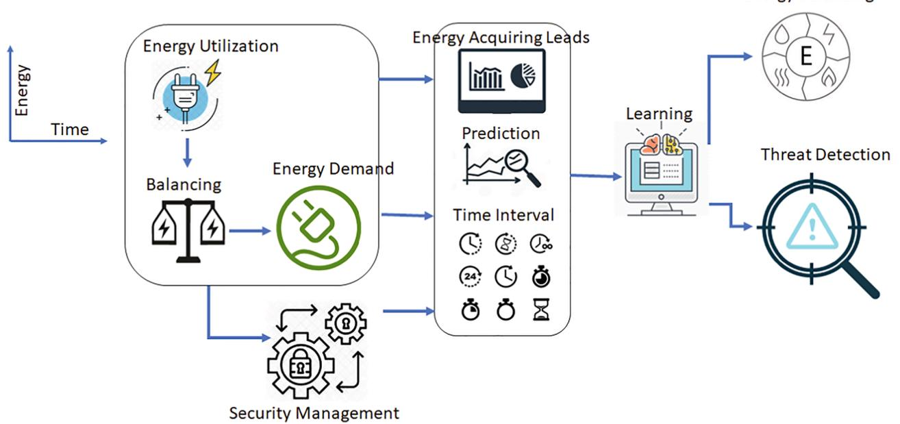

In the above equation (4),the detection of threat in a smart home is represented as $\begin{array} { r } { \sqrt { \left( \frac { \boldsymbol { \vartheta } ^ { \prime } + \boldsymbol { \delta } ^ { \prime } } { k ^ { \prime } / \mu _ { 0 } } \right) } ^ { * } \sum _ { \mathfrak { f } _ { 0 } } ( \boldsymbol { \delta } ^ { \prime } + \boldsymbol { \chi ^ { \prime } } ) } \end{array}$ In his continuous trcking of energyare derived.In Fig.3,the process of threat detection is illustrated. 

The analysis is based on a prediction method that evaluates based on two derivations and concludes whether it is equal to O or not.Here the first derivation is represented as $\left( ( \psi ^ { * } \chi ^ { * } ) + \frac { \mathcal { V } ^ { * } + \chi ^ { * } } { \phi _ { 0 } } \right) + k ^ { \prime }$ in this, the prediction for the energy acquiring leads to track the vulnerability and exploitation in the smart home.In this,it is equal to O in which it detects the threats by evaluating the prediction for every particular time.The second derivation is formulated as $\sqrt { \left( \frac { \mathfrak { u } _ { 0 } - \dot { \eta ^ { * } } } { \mathcal { V } ^ { * } + \dot { \gamma ^ { * } } / \vartheta ^ { * } } \right) }$ the updating process is not performed on time,it does not detect the threats,and it is not equal to O.Post to this update is derived by introducing a Q-learning that defines the two states,such as operating and communication. 

# Q-Learning process for SSAM 

The Q-Learning is used to identify and update the states based on energy appliances to maintain sustainability in smart homes.To find the threats,Q-learning is used and updates the states of the process.Here both the exploitation and vulnerability are tracked and increases the security level and lifetime of energy in smart homes. The scope of using Q-learning in this work is to provide a recommendation to update the security level. In these two types of detection are identified, the preliminary step is if a threat hacks the appliances to use or modify the energy means more energy utilization occurs,energy efficiency cannot be achieved.The smart meter can increase the risk of misuse,identity theft,and cybercrime when using smart home technology. Learning more about how smart home technology can put you at risk can ensure that your home network is safe.A system threat refers to the abuse of the system and network resources to create customer problems.System threats Device threats can be implemented on a full network called software assault to initiate program threats.Threats to the system create an environment that misuses operating system resources/user files. 

The second constraint is if the attacker hacks the energy,it means it surrenders the energy,whereas the security level decreases.If any of the security levels or exploitation of the vulnerability factor decreases,the update process is evaluated to improve the security level. The following equation is used to formulate the reward function based on Q-learning. 

The Q-Learning is derived based on state and action.In this,the discount factor is used to improve the reward function, in Q-learning which is represented $\mathsf { a s q } _ { 0 }$ . As of computing equation (5),the continuous tracking of energy is derived from the recommendation of providing security formulated in the above equation.In this,the state and action of consuming energyare processed,and itis defined as $\therefore \mathrm { a n d } \mathcal { A } _ { 0 }$ .Where the reward function is denoted as $r '$ which is based on the discount factor $\mathbf { a } \mathbf { s } \mathfrak { D } _ { 0 }$ . In the above equation, the q-learning based on state and action is evaluated to update and identify the smart home threat.Thus,the following equation is used to provide the security measure to the smart meter,which is derived by computing the state. 

---

==== 第 6 页 ====

**Fig. 4.Security Management. **
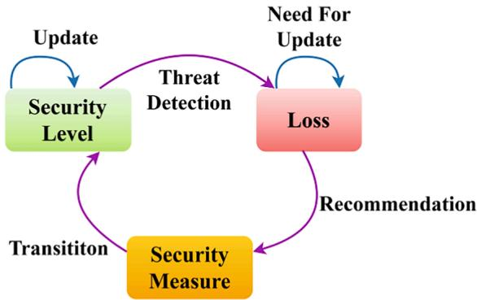

**Fig.5.Energy Management. **

computer is to change the password and turn the device into something special. When a hacker discovers a password, they will try to use it on some other account. 

In Figs.4 and 5,the Q-Learning Process for security and energy management is illustrated. 

Here the update of state and action is defined by Q-Learning as $\left( \mathbb { u } _ { 0 } + \delta ^ { ^ { \prime } } \right) + \mathbb { q } _ { 0 }$ by processing,this sustainability of energy is derived.By computing $\left( \frac { \sum _ { \delta } \left( \psi + \phi _ { 0 } \right) } { \tau + \mathcal { V } ^ { \cdot } } \right)$ the smart meter energy is tracked to avoid the threats by resolving the shortcomings in the security measure. In this manner, the representation of $\left( \mathfrak { D } _ { 0 } - r ^ { ' * } \frac { \mathfrak { u } _ { 0 } } { \sum \mathfrak { q } _ { 0 } } \right)$ is computed to process the reward function based on the discount factor. It is processed by updating the Q-Learning based on energy from the smart meter.The smart home state and action are computed from this equation,and outputs are derived for administering smart meter security.By comparing equations (4） and (6),the periodical manner of energy acquiring and the state and action are rewritten in the following equation. 

The Q-learning analysis is evaluated to identify the smart meter's security level and protect it from vulnerability.Here the continuous monitoring is processed by computing $\Bigg ( \frac { \chi ^ { * } ( \gamma ) } { \psi } \Bigg ) + \sqrt { \Bigg ( \frac { \natural _ { 0 } } { \tau / \mathcal { V } } \Bigg ) }$ in this, the tracking of attackers in the smart meter is determined.Thus,the update of Q-learning is evaluated to detect vulnerability and exploitation. By 

In the above equation $( 7 )$ ,the state and action are computed from the equation's general format (6).Here the reward function is derived based on the threats.Thus the processing of energy from the smart meter is updated using Q-learning.Here it addresses two constraints by evaluating the above equation where the operating and communication state is acquired,which is denoted as $\mathcal { C } _ { 0 }$ andi’thus,the actionis termed as power regeneration.For every incoming energy to the smart meter, the action is determined where it is processed based on time.By formulating $\left( \frac { \psi } { \gamma / \vartheta } \right) ^ { * } ( \eta ^ { ' } ) + ( \tau + \mathcal { V } ^ { ' } )$ the threats are identified by tracking the smart meter for every time interval.The use of the Internet on connected devices is another way of providing IoT protection.Save vital data out of leakage by blocking a program behind a firewall or limiting use to such software features.The new updates should update all devices linked to the network.Default passwords are shipped on most smart home computers.Some companies need the default password to be changed before the home technology is implemented.The first thing that users should do to ensure that hackers don't force their way into their smart home formulation $\begin{array} { r } { ( \mathbb { S } ^ { ' } + \mu _ { 0 } ) ^ { * } \left( \frac { q ^ { * } + \dot { \delta } ^ { * } } { \mathfrak { u } _ { 0 } / \mathfrak { D } _ { 0 } } \right) } \end{array}$ security is derived for acquiring energy efficiency.The Q-learning is analyzed based on the state and action on a periodic time interval from this equation.Thus, the security level verification is maintained to analyze the two constraints,and the following equation (9) is used to balance the energy. 

In the above equation (9),the verification phase is computed in which the security level is acquired in the mentioned time or not. By formulating $\left[ \frac { ( \phi _ { 0 } + \delta ^ { ' } ) ^ { * } \eta ^ { \cdot } } { \prod _ { \chi ^ { ' } } ( \dot { \gamma ^ { ' } } + \mathbb { q } _ { 0 } ) } \right]$ the home appliances’security is derived in this continuous tracking of energy is processed based on Q-Learning.In this, state and action are defined to find threats and provide security to the smart meter.If the verification is derived appropriately,the ‘if condition'is processed else otherwise condition is computed. 

Post to the verification, the update of Q-Learning is processed for either vulnerability or exploitation.The update of Q-learning is processed based on state and action associated with reward and discount factors for resolving.The following equation (lO） is equated with updating the security level,which acts as the recommendation step to upgrade the cyber security in the smart home. 

---

==== 第 7 页 ====

The update process is calculated based on Q-learning in this reward function,and the state is defined to improve the security level.If the vulnerability or exploitation is monitored in the smart meter,it means Q-learning performs the update. By formulating $\Bigg ( \psi + \frac { \mathcal { C } _ { 0 } { } ^ { * } \mathrm { i } } { \tau + \mathcal { V } } \Bigg )$ both the communication and operating states are defined where they address the vulnerability and exploitation.Here,the reward function is used to define the upcoming energy from the appliances and evaluate energy verification.In this equation,the update is applied to enhance the security level based on the following equation to calculate the security from threats.A compromised router opens up much vulnerability in homes with a home WI-FI network where cybercriminals can access computers,equipment,personal and security cameras,such as baby monitors and CCTV.Smart home technology has been developed to make it easier to access and monitor different features and devices at home and to operate more efficiently.People attach an intelligent computer to their home and other existing devices by incorporating smart home technology.The interconnectivity enables you to work together and access parts of your home from your mobile device.It will increase the risk of misuse,identity stewardship,and cyber-crime when using smart home technology.Learning more about how smart home technology can expose you to danger can help you take steps to ensure your home network's safety. 

The security level is defined based on the updating process in equation (1O); it detects the threats and upgrades the security.Here the state and action are determined based on the smart home in which it securely acquires the energy.If a threat hacks the appliances to use or modify the energy,more energy utilization occurs,energy efficiency cannot be achieved.In this case,the security level decreases;hence the update process is deployed to enhance energy utilization.In this processing,the update is performed based on Q-learning,where the state and action are defined.The energy tracking is used to improve the security level,which is computed in the following equation (l2）as follows. 

The continuous tracking of energy is computed in the above equation.In this,they are two derivations that are computed.Here,equal to O and not equal to O is defined to evaluate a smart home's security level. The first derivation represents the Q-learning update process to analyze the data periodically.It addresses the threats in the mentioned time interval; it is equal to O,whereas the second derivation,the analysis of state and action,is not computed on time.In this,the security level is addressed and improved in the first derivation.Based on this,sustainability is equated in equation (l3) associated with the recommendation process of Q-Learning. 

**Fig.6.Energy and Security Management. **
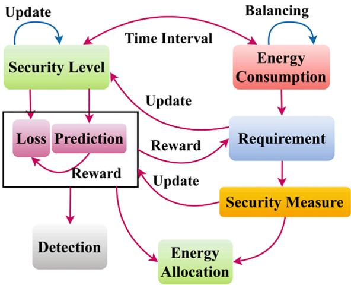

**Table 1 Energy Efficiency for Different Prediction Values. **
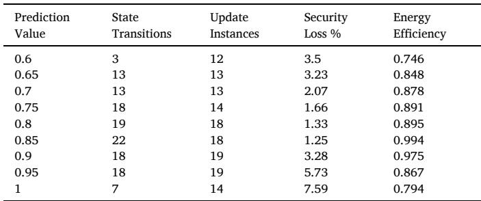
<table><tr><td>Prediction Value</td><td>State Transitions</td><td>Update Instances</td><td>Security Loss %</td><td>Energy Efficiency</td></tr><tr><td>0.6</td><td>3</td><td>12</td><td>3.5</td><td>0.746</td></tr><tr><td>0.65</td><td>13</td><td>13</td><td>3.23</td><td>0.848</td></tr><tr><td>0.7</td><td>13</td><td>13</td><td>2.07</td><td>0.878</td></tr><tr><td>0.75</td><td>18</td><td>14</td><td>1.66</td><td>0.891</td></tr><tr><td>0.8</td><td>19</td><td>18</td><td>1.33</td><td>0.895</td></tr><tr><td>0.85</td><td>22</td><td>18</td><td>1.25</td><td>0.994</td></tr><tr><td>0.9</td><td>18</td><td>19</td><td>3.28</td><td>0.975</td></tr><tr><td>0.95</td><td>18</td><td>19</td><td>5.73</td><td>0.867</td></tr><tr><td>1</td><td>7</td><td>14</td><td>7.59</td><td>0.794</td></tr></table>

In the above equation (l3),sustainable energy exploitation is calculated in this prediction method to find the smart meter attacker. The action is processed in the smart meter by acquiring the energy in this; it defines the communicating and operating state. This Q-learning based update is processed for security level improvement. If this is provided efficiently,sustainability is achieved in a better manner.A variety of intelligent devices have become common in homes worldwide,taking us closer to the realities of smart appliances or houses solely dependent on advanced systems.Heating，lighting，and common equipment,such as doorbells,alarm systems,and entertainment devices are increasingly built to run on the internet (IoT). However, some specialists have raised valuable safety concerns about advanced techniques and claimed that these devices are especially vulnerable to cybercriminals.Some may argue that it does not cost the time it takes to install smart systems without security issues. 

Thus,the threats are addressed,and both the sustainability and security level are improved.In equation (14), the verification time and security loss are estimated. 

---

==== 第 8 页 ====

**Fig.7.Energy Consumption for Diferent Time and Security Levels. **
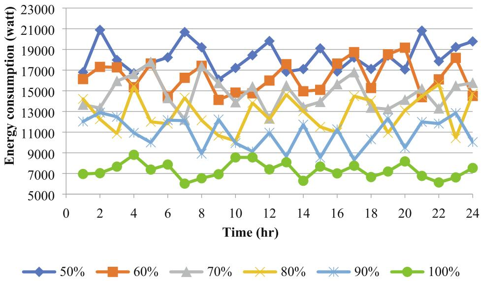

**Fig.8.Energy Requirement at Different Time (Application $= 5$ 10). **
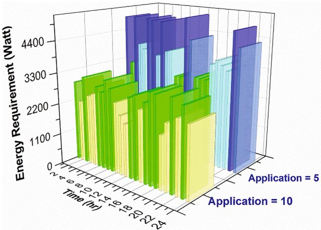

**Fig.10.Security ${ \mathrm { L o s } } { \% }$ for different Reward. **
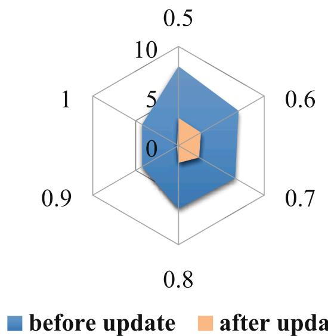

**Fig.9.Security Update Instances for different Reward Factor. **
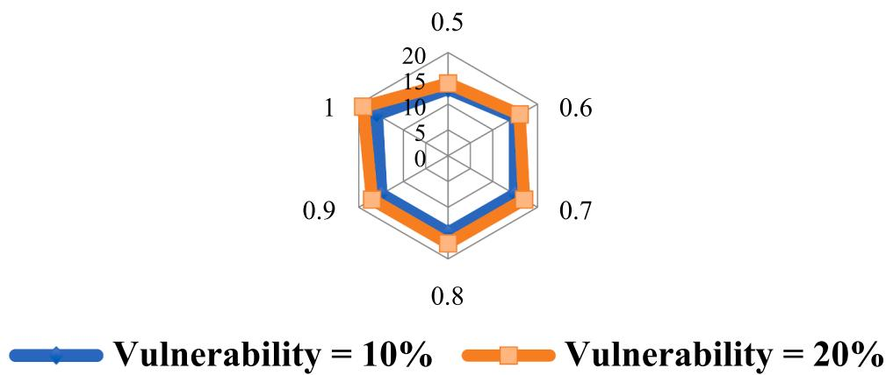

---

==== 第 9 页 ====

**Fig.11.Threat Detection for different Update Instances and Security Level. **
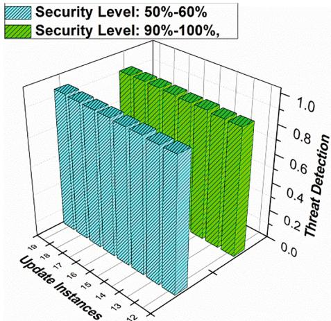

**Fig.12.Verification Time for Applications,Security $\%$ ,and Time. **
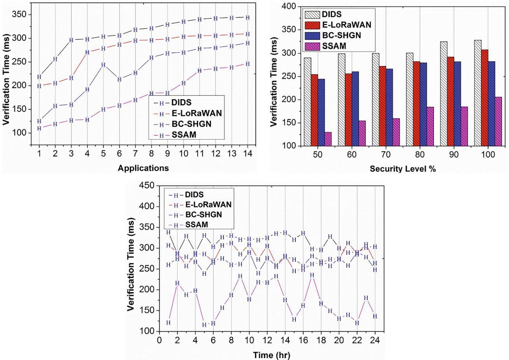

---

==== 第 10 页 ====

# Security level 

**Fig.13.Security Level $\%$ for Applications and Time. **
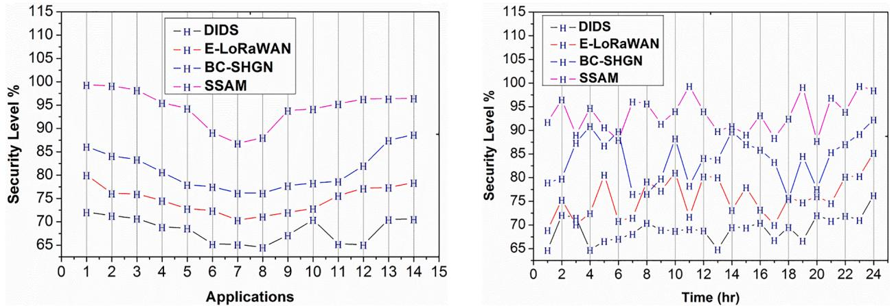

# Energy efficiency 

**Fig.14.Energy Eficiency for Applications, Security Level $\%$ ,and Time. **
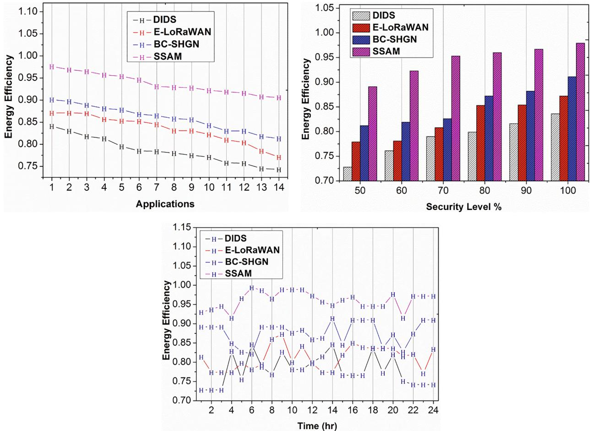

---

==== 第 11 页 ====

# Security loss 

**Fig.15.Security Loss $\%$ for Applications and Time. **
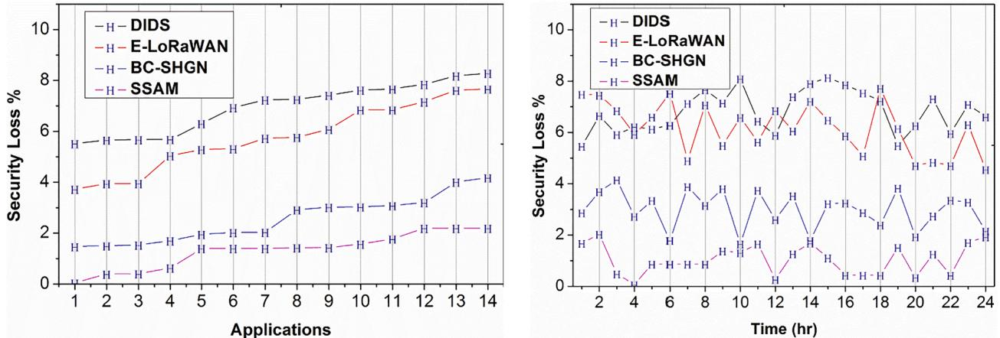

The recognition of service loss and verification time is decreased by formulating the above equation.The joint process of energy and security management using Q-Learning is illustrated in Fig. 6. 

The recognition is defined as $\mathbb { R } _ { 0 }$ the first condition is service loss, which is decreased by tracking the energy periodically and evaluating the secure analysis based on a timely manner.By processing,this security level improves,whereas the security loss is decreased,in the second condition states the verification time.It is computed by processing the data in the mentioned time interval in which the update is evaluated using Q-learning. Thus, both the verification time and security loss is addressed and decreased.In Table 1,the energy efficiency for different prediction values is tabulated. 

The proposed work's objective is satisfied by equating equations (13) and (14) in this cyber security is evaluated to compute efficient energy management. In this,the sustainability of energy is computed by continuous monitoring of energy in the smart meter. Here the Q-learning is responsible for making a recommendation process to update the security level. Thus,two constraints are addressed and improve the performance and sustainability of energy in a smart home.For the use of renewables and stored energies,smart homes need an energy management system.The relation between energy sources and loads can be automated for improved energy efciency.The integration of information technology and IoT leads to cyber-physical power systems.Energy management is a way to regulate and reduce buildings’energy use, allowing owners and managers to reduce energy costs by 25 percent of all office building operational costs.Reduce emissions of carbon to meet internal environmental targets and regulatory criteria. 

The energy consumption for the smart home is derived by computing $\sqrt { ( \eta ^ { ' * } \vartheta ^ { ' } ) + \gamma ^ { ' } }$ in this,the time-based verification is determined.For every security level, the energy consumption varies in this by comparing with $5 0 \%$ the $1 0 0 \%$ shows a higher security level. In this case, energy consumption decreases (Refer to Fig.7). 

The time-based energy requirement is defined as various types of applications in which the security level is increased.In this processing, two applications are derived, such as 5and 10,compared to 5 1O shows higher energy requirements.It is based on the number of increases in home networks; the condition differs (Refer to Fig.8).The smart household heat management system keeps track of which rooms are occupying and ensures that they are warm enough while they are used. The house won't overheat itself when people are gone.People won't have to wait until it warms up when you're here.A smart house will keep you comfortable.Solar panels are a perfect feature for your house. People can always ensure the solar panels are optimal by installing them on their rooftop and connecting them to your smart home.Smart houses differentiate between the energy your home creates and the energy you buy.People can opt to use their resources and use additional energy if necessary.The standard energy consumption measure is the watts consumed over one hour,often referred to as the watt-hour period. One kilowatt-hour is 1ooo W-hours,meaning 4 kWh of electricity would be consumed from an air conditioner of 4ooo W for one hour.You reduce the number of harmful fumes emitted by power plants,conserving the earth's natural resources,and protecting habitats against destruction by consuming less power. 

The reward function is calculated to update the security level based on the Q-learning approach in which this security update instance is derived.If the reward function increases,the security updated instance increases those results in detecting the vulnerability.Thus,it shows $1 0 \%$ and $2 0 \%$ vulnerability; compared to $1 0 \%$ ， $2 0 \%$ show higher security update instances (Fig. 9). 

The reward function is processed based on security loss in this energy acquisition defined by the smart meter. Suppose the security loss decreases,the reward function increases by processing before and after updates.By comparing it with the before the update,the after update shows lesser security loss in which it increases the security level (Refer to Fig. 10). 

The update instances are determined to detect the threats in the home that hacks the energy and modifies.The threat detection is evaluated for every security level that varies based on application.If the update instance increases,the threat detection increases; in this manner, $5 0 \%$ and $6 0 \%$ show lesser threat detection,whereas $9 0 \%$ and $1 0 0 \%$ show higher threat detection (Refer to Fig.11). 

# Discussion 

The performance of the proposed SSAM is analyzed in this section using an experimental setup containing 14 home applications connected to a smart meter. The network is constructed using one internet gateway connected to a physical computer of storage 5Oo GB. The performance of the applications is monitored for $2 4 \mathrm { h } ^ { \prime }$ time interval. The operation logs and identity is preserved by the digital signature used by the manufacturer.The updating instance of the security measure is set as 20 (maximum). The proposed SAAM performance is measured using the metrics verification time,security level,energy efficiency,and security loss.For a comparative analysis,the existing methods DIDS [2O],ELoRaWAN [21],and BC-SHGN[19] are considered. 

---

==== 第 12 页 ====

**Table 2 Comparison Results for Applications. **
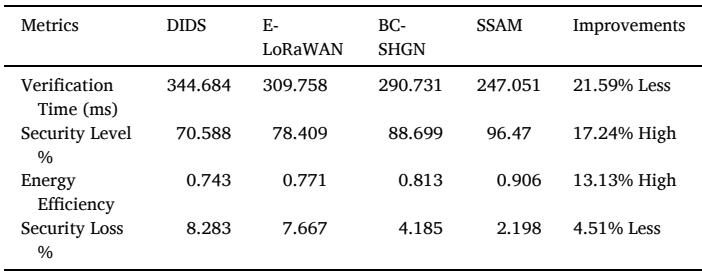
<table><tr><td>Metrics</td><td>DIDS</td><td>E- LoRaWAN</td><td>BC- SHGN</td><td>SSAM</td><td>Improvements</td></tr><tr><td>Verification Time (ms)</td><td>344.684</td><td>309.758</td><td>290.731</td><td>247.051</td><td>21.59% Less</td></tr><tr><td>Security Level %</td><td>70.588</td><td>78.409</td><td>88.699</td><td>96.47</td><td>17.24% High</td></tr><tr><td>Energy Efficiency</td><td>0.743</td><td>0.771</td><td>0.813</td><td>0.906</td><td>13.13% High</td></tr><tr><td>Security Loss %</td><td>8.283</td><td>7.667</td><td>4.185</td><td>2.198</td><td>4.51% Less</td></tr></table>

**Table 3 Comparison Results for Security Level $\%$ **
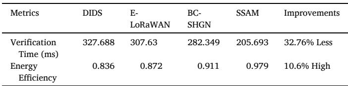
<table><tr><td>Metrics</td><td>DIDS</td><td>E- LoRaWAN</td><td>BC- SHGN</td><td>SSAM</td><td>Improvements</td></tr><tr><td>Verification Time (ms)</td><td>327.688</td><td>307.63</td><td>282.349</td><td>205.693</td><td>32.76% Less</td></tr><tr><td>Energy Efficiency</td><td>0.836</td><td>0.872</td><td>0.911</td><td>0.979</td><td>10.6% High</td></tr></table>

**Table 4 Comparison Results for Time (hr). **
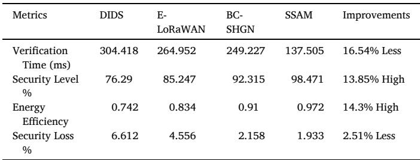
<table><tr><td>Metrics</td><td>DIDS</td><td>E- LoRaWAN</td><td>BC- SHGN</td><td>SSAM</td><td>Improvements</td></tr><tr><td>Verification Time (ms)</td><td>304.418</td><td>264.952</td><td>249.227</td><td>137.505</td><td>16.54% Less</td></tr><tr><td>Security Level %</td><td>76.29</td><td>85.247</td><td>92.315</td><td>98.471</td><td>13.85% High</td></tr><tr><td>Energy Efficiency</td><td>0.742</td><td>0.834</td><td>0.91</td><td>0.972</td><td>14.3% High</td></tr><tr><td>Security Loss %</td><td>6.612</td><td>4.556</td><td>2.158</td><td>1.933</td><td>2.51% Less</td></tr></table>

# Verification time 

In Fig.l2,the proposed work's verification time shows lesser value by comparing it with the existing methods. By formulating $\left[ \frac { ( \phi _ { 0 } + \delta ^ { * } ) ^ { * } \eta } { \prod _ { \chi ^ { * } } ( \dot { \gamma } + \mathbb { q } _ { 0 } ) } \right]$ secure energy usage is derived,which is based in a timely manner.In this,continuous tracking of energy from the smart meter is evaluated to achieve reliable results.It protects life from the vulnerability in-network and improves the security level by processing cyber security.Here,the Q-learning is used to update the system's processing of security level, which detects the vulnerability and updates the processing steps.The verification time is based on acquiring the energy from the smart meter and stores an in-home network.If the attackers hack the home network, the security level decreases;in this case,the verification time exceeds.In this proposed work,cyber security is a measure responsible for protecting the system,decreasing the verification time.In this manner, the time-based processing is determined concerning security level and applications. 

# Security level 

The security level for the proposed work increased by computing $\sqrt { \left( \frac { \delta } { \vartheta ^ { ' } / \varpi } \right) }$ in this,the verification time is analyzed.In this case,energy acquiring is verified by the smart meters.Based on this,and it secures the home network from hacking. Thus,continuous monitoring leads to efficient energy consumption in which the security level is achieved optimally. Q-learning based update is processed to improve the security level in which it addresses the two detection process. Providing energy based on the prediction process in which the utilization of energy is decreased.In this case,the time-based energy tracking in the smart meter is necessary to address the security level. Here the cyber security based security is derived by evaluating $( \tau + \mathcal { V } ^ { ' } ) ^ { * } \left( \frac { \psi } { \dot { \gamma } } \right)$ in this, vulnerability and exploitation are detected.In this case,the detection of attacks is processed and avoids hacking energy in the smart home.This operating and communicating state is defined based on the action in the smart home.This state considers the energy consumption and requirement.Thus,Q-learning is used as the recommendation process to derive the security level based on energy (Refer to Fig.13). 

# Energy efficiency 

The proposed work's energy efficiency shows a higher value by comparing it with the other three methods.In this sustainability of energyina smart home,it is evaluated by maintaining the smart meter's energy level. By formulating $\left( \frac { k ^ { ^ { \prime } } ( \gamma ^ { ^ { \prime } } ) } { \vartheta ^ { ^ { \prime } + \delta } } \right) ^ { * } ( \psi + \mathcal { A } _ { 0 } )$ the prediction based verification is derived in this energy from the smart meter is acquired on time.In this case,energy efficiency is improved by increases the security level concerning time and applications.For all iteration,the acquired energy derives the optimal energy efficiency mechanism in which it decreases the verification time.In this case,the states in Q-learning are used to determine the sustainability of energy.Based on the action, the energy consumption is derived in a smart home,which is denoted $\begin{array} { r } { \arg _ { \mathcal { V } ^ { \ast } \tau } \bigg ( \frac { \mathcal { A } _ { 0 } } { j } \bigg ) \ + \ ( q ^ { ^ { \ast } } \tau \varpi ) } \end{array}$ ． In this processing，the exploitation of the vulnerability is monitored and detects the attacks based on action.Thus, sustainability is provided to the smart home in which energy eficiency is increased for the proposed method (Refer to Fig.14). The biggest engine for smart and sustainable urban planning is reducing the carbon footprint.The greatest benefits include enhancing energy efficiency, storage，and waste management，and traffic conditions.Repeating concepts of smart cities are smart grids and smart water management. Heating and cooling systems are very similar in energy waste.Perhaps you have left appliances or lights in the house,and you remember that when you come home from work or even on holidays.People do not have to be worried about these kinds of the problem if you can manage anything right from a smartphone.The bank account and your wallet are stronger. One of the main advantages of this form of technology is that it does not worry much about being forgetful. Smart homes are a growing development that helps improve the environment (see Fig.15). 

# Security loss 

The security loss decreases for the proposed work by deriving $\sqrt { \left( \frac { { \mathfrak { q } } _ { 0 } + { \mathfrak { u } } _ { 0 } } { r / { \mathfrak { D } } _ { 0 } } \right) }$ in this; the update of Q-learning is performed.In this case, the reward function is used to improve the update process in which it determines the energy level. As a result of this computing $\begin{array} { r } { \left( \frac { \chi } { \psi + \varpi } \right) + ( \phi _ { 0 } - \eta ^ { * } ) } \end{array}$ the tracking of energy is evaluated based on time.Approximately $8 0 \%$ of IoT devices are vulnerable to several attacks.Indeed, there are various cyber security risks to attach 'self-contained’smart devices such as lights,computers,and locks typically.Even linked child monitors are vulnerable to digital intruders,asa fewhorrified parents discovered late when hackers talked through compromised devices to their young children.An intruder interrupts communication between two processes or interrupts communication between them.Fake temperature data 'produced'by a monitoring system can be manipulated and transmitted to the cloud. Similarly,an attacker can disable vulnerable Q-learning state systems on a heat wave and create a catastrophic scenario for the models involved. 

---

==== 第 13 页 ====

Thus,the energy analysis is derived from providing security for the home network from the acquired energy.In this,the discount factor is evaluated based on the reward function for the update process.The recognition of security loss is computed in equation (14),where the time-based tracking is processed.Here the sustainability of energy is achieved by improving the security level in smart homes.It is necessary to secure a network by controlling security on a system level,which means a safety layer on the connecting device.An example is where an end-user must first login before it can link to a network and mark the end-user as an authorized user unless the credentials are signed correctly. Several protocols are in place that must be implemented in a network to allow devices to link be monitored for connection to a network. 

The evaluation of security loss is performed based on different types of applications and time.Every time the energy acquiring varies based on this security level differs in this case; continuous monitoring is derived.Thus,the communication and operating states are defined in Qlearning to address the network's security loss. In Tables 2,3,and 4, the comparative analysis for the differentapplications,security level $\%$ ,and time are tabulated.In these tables,the improvements are tabulated. 

# Conclusion 

This article discusses the seamless security apprise method for providing uncompromised application monitoring measures in a smart home environment.The proposed method monitors the security level of the administered application for its vulnerable exposure level.If this level is less,then the security measures are updated to combat identity theft attacks. This process is augmented using Q-Learning for identifying the security and energy management states of the applications and their functions.While using the prediction and reward function, the level of security and energy requirement is administered and balanced using the learning recommendations.It helps to monitor the security level of the application irrespective of its operating time.The overall process is integrated with the cyber security features of a centralized smart home management system.The performance assessment of the proposed method is verified using appropriate experiments.It is found to achieve less verification time and security loss,whereas it improves security and energy efficiency. 

# Data Availability statement 

No data available. 

# CRediT authorship contribution statement 

Mohammed Saeed Alkatheiri: Conceptualization, Methodology, Software.Sajjad Hussain Chauhdary: Data curation, Writing - original draft,Investigation, Supervision.Mohammed A.Alqarni: Visualization, Software,Validation, Writing -review& editing. 

# Declaration of Competing Interest 

The authors declare that they have no known competing financial interests or personal relationships that could have appeared to influence the work reported in this paper. 

# Acknowledgment: 

This work was funded by the University of Jeddah, Saudi Arabia, under grant No. UJ-02-012-ICGR.The authors, therefore,acknowledge with thanks the University's technical and financial supports. 

We are thankful for Dr. Shahid Mumtaz's Consultancy and Dr. Ali 

Kashif Bashir's technical support in this research work. 

# References 

[1] Riekstin AC, Langevin A, Dandres T, Gagnon G, Cheriet M. Time series-based GHG emissions prediction for smart homes. IEEE Trans Sustainable Comput 2020;5(1): 134-46.   
[2] Dutra MDDS, Anjos MF, Digabel SL.A general framework for customized transition to smart homes. Energy 2019;189:116138.   
[3] Walzberg J, Dandres T, Merveille N, Cheriet M, Samson R. Assessing behavioural change with agent-based life cycle assessment: Application to smart homes. Renew Sustain Energy Rev 2019;111:365-76.   
[4] Shangguang Wang,Ao Zhou, Ching-Hsien, Xuanyu Xiao,Fangchun Yang. Provision of data-intensive services through energy-and qos-aware virtual machine placement in national cloud data centers.IEEE Trans Emerg Top Comput 4(2):290- 300.   
[5] Zaidan AA, Zaidan BB, Qahtan MY,Albahri OS,Albahri AS,Alaa M, Jumaah FM, Talal M, Tan $\mathrm { K L } ,$ Shir WL,Lim CK.A survey on communication components for IoTbased technologies in smart homes. Telecommun Syst 2018;69(1):1-25,2018.   
[6]Leszczya R. Cybersecurity and privacy in standards forsmart grids -A comprehensive survey. Comput Stand Interfaces 2018;56:62-73. [7] Vijayalakshmi Saravanan, Anpalagan A, Woungang I. An Energy-Delay Product Study on Chip Multi-Processors for Variable Stage Pipelining.Human centric Computing and Information Sciences (HCIs), Springer (Online); 2015.   
[8] Shen J, Wang C,Li T, Chen $\mathrm { X } ,$ Huang $\mathrm { X } ,$ Zhan Z-H. Secure data uploading scheme for a smart home system. Inf Sci 2018;453:186-97.   
[9] Jegadeesan S, Azees M, Kumar PM, Manogaran G, Chilamkurti N, Varatharajan R, et al. An eficient anonymous mutual authentication technique for providing secure communication in mobile cloud computing for smart city applications. Sustain. Cities Soc. 2019;49:101522.   
[10] Karthikeyan K, Sunder $\mathbb { R } ,$ Shankar K, Lakshmanaprabu SK, Vijayakumar V, ElhosenyM,ManogaranG.Energyconsumptionanalysisof VirtualMachine migration in cloud using hybrid swarm optimization (ABC-BA).J Supercomput 2020.https://doi.0rg/10.1007/s11227-018-2583-3.   
[11] Sheron PSF, Sridhar KP, Baskar S, Shakeel PM. A decentralized scalable security framework for end to end authentication of future IoT communication. Trans Emerg Telecommun Technol 2020:e3815.   
[12]KoH,KimJH,AnK,MesicekL,MarreirosG,PanB,eal.marthoergy strategy based on human behaviour patterns for transformative computing. Inf Process Manage 2020;57(5):102256.   
[13] Filho GPR, Villas LA, Goncalves VP, Pessin G,Loureiro AAF, Ueyama Jó.Energyeficient smart home systems: Infrastructure and decision-making proces. Internet of Things 2019;5:153-67.   
[14] Strengers Y, Hazas M, Nicholls L, Kjeldskov J, Skov MB. Pursuing pleasance: Interrogating energy-intensive visions for the smart home. Int J Hum Comput Stud 2020;136:102379.   
[15] Modarresi A,Symons J.Technological heterogeneityand path diversity insmart home resilience: a simulation approach. Pro Comput Sci 2020;170:177-86.   
[16] Zungeru AM,Gaboitaolelwe J,Diarra B,JC.M.,Ang L-M,Kolobe L, David M, Zibani I."A secured smart home switching system based on wireless communications and self-energy harvesting.IEEE Access 2019;7:-25085.   
[17] Shuai M, Yu N, Wang H, Xiong L. Anonymous authentication scheme for smart home environment with provable security. Comput Security 2019;86:132-46.   
[18] Minoli D. Positioning of blockchain mechanisms in IoT-powered smart home systems: A gateway-based approach. Internet of Things 2020;10:100147.   
[19] Lee Y,Rathore S,Park JH,Park JH.A blockchain-based smart home gateway architecture for preventing data forgery.Human-centric Comput Inf Sci 2020; 10 (1).   
[20] Gajewski M, Batalla JM, Mastorakis G, Mavromoustakis CX. A distributed IDS architecture model for Smart Home systems. Cluster Comput 2017;22(S1): 1739-49.   
[21] Naoui S,Elhdhili ME,Saidane LA. Novel enhanced LoRaWAN framework for smart home remote control security. Wireless Pers Commun 2019;110(4):2109-30.   
[22] Naoui S, Elhdhili ME, Saidane LA. Lightweight and secure password based smart home authentication protocol: LSP-SHAP. J Netw Syst Manage 2019;27(4): 1020-42.   
[23] Yu L, Jiang T, Zou Y. Online energy management for a sustainable smart home with an HVAC load and random occupancy.IEEE Trans Smart Grid 2019;10(2): 1646-59.   
[24] Mbungu NT, Bansal RC, Naidoo RM. Smart energy coordination of autonomous residential home. IET Smart Grid 2019;2(3):336-46.   
[25] Iqbal J, Khan M, Talha M, Farman H, Jan B, Muhammad A, Khattak HA. A generic internet of things architecture for controling electrical energy consumption in smart homes. Sustainable Cities and Society 2018;43:443-50.   
[26] Akbari-Dibavar A, Nojavan S, Mohammadi-Ivatloo B, Zare K. Smart home energy management using hybrid robust-stochastic optimization. Comput Ind Eng 2020; 143:106425.   
[27] Popa D, Pop F, Serbanescu C, Castiglione A. Deep learning model for home automation and energy reduction in a smart home environment platform. Neural Comput Appl 2018;31(5):1317-37.   
[28] Albuquerque PUB,Ohi DKDA,Pereira NS,Prata BDA, Barroso GC.Proposed architecture for energy eficiency and comfort optimization in smart homes. J Control Autom Electr Svst 2018: 29(6):718-730. 

---

